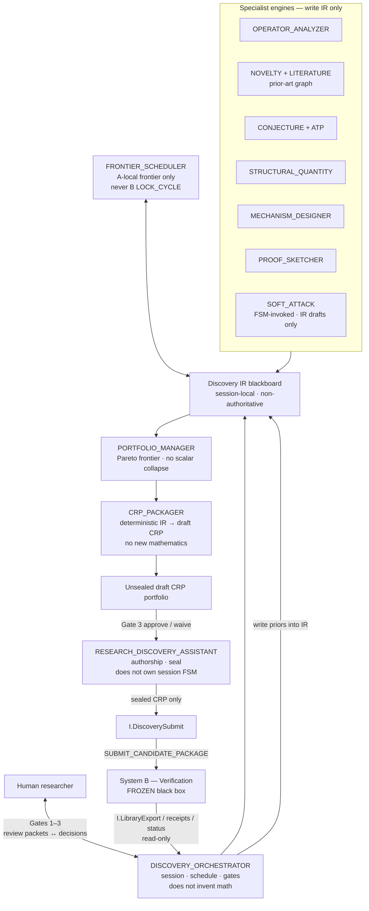

# ART-A-00 — Overall Architecture (System A)

**Artifact ID:** `ART-A-00`  
**Version:** `ARCH-0.3-REPAIR-DUAL.2`  
**Normative status:** `FROZEN`  
**Frozen:** `2026-07-24` (Section 1 — Overall architecture)  
**Owner:** Research Discovery Assistant (ART-01D)  
**Home:** `architecture-discovery/`  
**Depends on:** ART-01D · ART-04e · ART-08b · ART-CRP (B intake; read-only schema)  
**Does not modify:** Verification Architecture (`architecture_verifier/`)

> **FREEZE:** Section 1 is frozen. Do not change architecture shape without an explicit unfreeze. Later sections may add modules/contracts; they must not contradict this document.

## Purpose

Bind System A’s overall architecture: gated discovery over a shared Discovery IR; specialist engines invent and revise; packager compiles draft CRPs; author role seals; System B remains a frozen black box behind `SUBMIT_CANDIDATE_PACKAGE`.

## One sentence

System A is a gated discovery session over a shared Discovery IR; specialist engines invent and revise; a packager compiles portfolio members into draft CRPs; the discovery author role seals; System B remains a frozen black box behind `SUBMIT_CANDIDATE_PACKAGE`.

## Architecture diagram

## Architectural roles (responsibility split)

The specification separates **responsibilities**. It does **not** require separate runtime components; one implementation may expose both orchestrator and author roles.

| Role | Owns | Explicitly does not |
|------|------|---------------------|
| `DISCOVERY_ORCHESTRATOR` | Session lifecycle, scheduling, routing, gate management, workflow control | Invent mathematics; seal CRPs; control B |
| `RESEARCH_DISCOVERY_ASSISTANT` | Mathematical authorship, CRP authorship, sealing, immutable submission snapshots | Own/control the session FSM |
| `FRONTIER_SCHEDULER` | A-local question/frontier selection (ART-08b continuity) | `LOCK_CYCLE` or any B ResearchState mutation |

## Hard boundaries

| May | Must not |
|-----|----------|
| Speculate, invent, soft-attack, revise IR, assemble draft CRPs, seal after Gate 3 policy | Certify, promote, demote, mint authoritative CX, close proof obligations, write B ResearchState/ControlState |
| Read B library + intake/obligation/CX *outcomes* as IR priors | Duplicate B schema validation, deps, obligations, audit, Lean, promotion |
| Pause at Gates 1–3 (or honor per-gate session waiver) | Submit an unsealed CRP; mutate a sealed CRP |

## Normative clarifications

1. **Seal:** Packager emits **unsealed draft CRPs**. Gate 3 approval (or documented waiver) precedes sealing. Only **sealed** CRPs may be submitted. Any revision creates a **new CRP** (lineage via `prior_crp_digest`); sealed packages are immutable.
2. **Roles:** Orchestrator vs Assistant as in the table above — responsibility split, not a mandated process split.
3. **Frontier:** Frontier Scheduler remains first-class on the IR; extend-in-place continuity with ART-08b.
4. **B feedback:** Verifier read-only outputs enter the Discovery IR as non-authoritative priors. Engines consume IR, not orchestrator-private memory. Receipts are never treated as certification/promotion authority.
5. **Human gates:** Bidirectional: Orch → Human review packets; Human → Orch approve / revise / reject / defer / waive. Waiver is **per-gate, session-scoped**; it does not waive B `admissible_package`.
6. **Session:** Every session has `session_id`, session-local IR, artifact lineage, portfolio branches (meaningfully distinct directions), and explicit session close. Detailed mechanics later; IR is never B authoritative state.
7. **Soft Attack:** FSM **invokes** Soft Attack. Soft Attack writes only non-authoritative IR artifacts (attack logs, falsifier drafts, rewrite proposals). It never performs B counterexample commands.
8. **Packager:** Deterministic compiler from Discovery IR → CRP shape. Introduces **no** new definitions, claims, mechanisms, or sketches at pack time. Portfolio Manager presents the frontier; it does not invent mathematics.

## Session shape (default)

Human scope → autonomous discovery on IR (engines + frontier) → **Gate 1** if scope/operator/objective shifts → refine (incl. soft-attack rewrites) → **Gate 2** if novelty quarantine → portfolio assembly + pack to **draft** CRPs → **Gate 3** (human may select any non-empty subset) → Assistant **seals** selected drafts → submit → B evaluates each CRP independently.

## Ownership (extend-in-place)

- **Keep:** ART-01D, ART-04e role model, ART-08b frontier, ART-08c cards, ART-A-NOV / ATP / MECH / CONJ
- **Add (modules; ART-04e roster update is documentation follow-on):** Operator Analyzer, Structural Quantity, Proof Sketcher, Soft Attack, Portfolio Manager, CRP Packager, Discovery IR
- **Rewrite ART-08:** keep S00–S08 discovery core; replace S09–S13 with A-local soft-attack / pack / gate states that **invoke** engines; S14–S16 = portfolio / frontier / session close

## Deferred to Section 2 (Internal Modules)

Write/read contracts, owned IR types, revision authority, and conflict resolution — not redefined here.

## Relation

- Charter: ART-01D  
- Operable roster: ART-04e / ART-A-04e  
- Intake schema (B): ART-CRP  
- A↔B interface: ART-INT-00 (`architecture-integration/`)  
- Design companion: `docs/superpowers/specs/2026-07-24-discovery-assistant-design.md`
