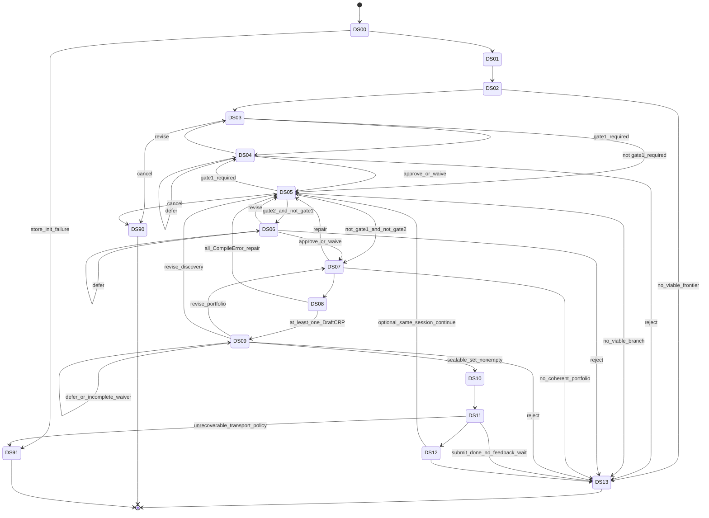

# ART-A-03 — Session Lifecycle & Discovery State Machine (System A)

**Artifact ID:** `ART-A-03`  
**Version:** `ARCH-0.3-REPAIR-DUAL.2`  
**Normative status:** `FROZEN`  
**Frozen:** `2026-07-25` (Section 3 — Session lifecycle)  
**Owner:** Research Discovery Assistant (ART-01D)  
**Home:** `architecture-discovery/`  
**Depends on:** ART-A-00 (FROZEN) · ART-A-02 (FROZEN + SessionEvent/SubmissionAttempt/SessionPolicy amendments) · ART-01D · ART-08b · ART-CRP (submit path only)  
**Does not modify:** Verification Architecture · ART-A-00 · ART-A-02 except documented ownership amendments

> **FREEZE:** Section 3 is frozen. Do not change FSM shape without explicit unfreeze.
>
> Section 3 defines **execution semantics** of a discovery session. It does not redefine architecture (ART-A-00) or module ownership (ART-A-02).

---

## 0. Normative principles

**I-A03-01 Control vs math.** Session control flow is **deterministic**. Mathematical nondeterminism is confined inside engines when they mint IR content.

**I-A03-02 Control ownership.** `DISCOVERY_ORCHESTRATOR` is the **control owner** of every DS state and the **sole** module that may commit FSM transitions and mint transition `SessionEvent`s. Executing modules perform state work but **never** advance the FSM.

**I-A03-03 Append-only history.** Every transition appends a `SessionEvent`. Illegal transitions are rejected; no silent skips.

**I-A03-04 Gate policy.** Gates 1–3 match ART-A-00 / ART-A-02 I-A02-11. Waivers are **session-scoped** and **gate-specific**; they never waive B `admissible_package`.

**I-A03-05 Verifier isolation.** System A’s only B mutation is sealed CRP → `I.DiscoverySubmit` → `SUBMIT_CANDIDATE_PACKAGE`. All other B contact is read-only.

**I-A03-06 Barriers & slices.** Synchronization barriers before Gate 1 evaluation, Portfolio construction, Draft compilation, Sealing, and Submission. Parallel engine work is allowed only inside a recorded `DiscoverySlice` (§9.1) between barriers.

**I-A03-07 Relation to ART-08.** This FSM is the normative discovery execution model for **new** sessions. Legacy ART-08 S00–S16 identifiers are **non-authoritative** for new work (migration detail: ART-A-07).

**I-A03-08 Gate-1 pre-portfolio guard.** Before entering DS07 or any later pre-seal state, the Orchestrator MUST evaluate `gate1_required`. Any unapproved scope, operator-class, or research-objective change forces transition to DS04.

**I-A03-09 Gate-3 waiver seal set.** A Gate 3 waiver is valid only when it includes or resolves to an explicit, nonempty seal set of successfully compiled `DraftCRP.version_id`s (§4).

**I-A03-10 Submit idempotency.** Each logical sealed submission is tracked by `SubmissionAttempt` within a `SubmissionBatch`; retries reuse the idempotency key without new Draft/Seal/Gate3 (§11.1). Batch/partial outcome semantics: ART-A-06 (authoritative); this section owns FSM timing only.

**I-A03-11 DS13 = orderly closure.** DS13 is terminal orderly closure (any listed `close_reason`), not “success only.” DS90 = cancellation. DS91 = unrecoverable control/infrastructure failure only (§3 DS91 allowlist).

**I-A03-12 Late feedback.** Feedback while session open may enter DS12 and MUST cite sealed package + receipt (§11.2). DS13 never reopens. No active `VerifierPrior` into a closed session. Late feedback seeds a **new** open session via authorized import. Archival receipt links after closure have no mathematical or FSM effect.

**I-A03-13 Slice authority.** ART-A-03 owns *when* DiscoverySlices open/close relative to FSM states. ART-A-05 owns *how* invocations execute inside a slice (inputs, depends_on, completions).

---

## 1. Session overview

```text
DS00 SESSION_INIT
  → DS01 SCOPE_BINDING
  → DS02 FRONTIER_SELECTION
  → DS03 DISCOVERY
  → [DS04 GATE1_REVIEW if gate1_required else skip]
  → DS05 REFINEMENT
  → [DS04 if gate1_required]
  → [DS06 GATE2_REVIEW if gate2_required else skip]
  → DS07 PORTFOLIO_CONSTRUCTION   # only if not gate1_required
  → DS08 DRAFT_COMPILATION
  → DS09 GATE3_REVIEW
  → DS10 SEALING
  → DS11 SUBMISSION
  → DS12 FEEDBACK_INGESTION       # optional / empty-ok
  → DS13 SESSION_CLOSE            # orderly closure (any close_reason)

Any active state → DS90 CANCELLED | DS91 FAILED (allowlist only)
```



---

## 2. Predicates

| Predicate | True when |
|-----------|-----------|
| `gate1_required` | Unapproved change to research **scope**, **operator class**, or **research objective** relative to current approved `ScopeBinding` version |
| `gate2_required` | Novelty quarantine signal requiring human review before portfolio path |
| `gate3_ready` | Every Gate-3 candidate has `DraftCRP` or `CompileError`; frontier nonempty |
| `sealable_set_nonempty` | Explicit nonempty set of successful `DraftCRP.version_id`s from Gate 3 approve **or** complete waiver (§4) |
| `session_open` | SessionRecord lifecycle not CLOSED / CANCELLED / FAILED |

Gate 1/2 skip when predicate false MUST append `SessionEvent` `GateSkipped` reason `NOT_REQUIRED`.

**Exit DS05 toward DS07:** Orch MUST re-evaluate `gate1_required` (I-A03-08). If true → DS04, never DS07+.

---

## 3. State specifications

**Convention:** **Control owner** = `DISCOVERY_ORCHESTRATOR` for every state. **Executing module(s)** never commit FSM transitions.

### DS00 — SESSION_INIT

| | |
|--|--|
| **Purpose** | Create session identity and empty IR substrate |
| **Control owner** | DISCOVERY_ORCHESTRATOR |
| **Executing module(s)** | DISCOVERY_ORCHESTRATOR; DISCOVERY_IR |
| **Entry** | Authorized open request |
| **Actions** | Mint `SessionRecord`; init store; open SessionEvent log; optional initial `SessionPolicy` |
| **Artifacts** | `SessionRecord`, `SessionEvent`, optional `SessionPolicy` |
| **Exit** | Session id assigned; IR ready |
| **Legal next** | DS01; DS90; DS91 (store init failure only) |
| **Failures** | Store init failure → DS91 |

### DS01 — SCOPE_BINDING

| | |
|--|--|
| **Purpose** | Bind Area-1 scope pin and session objective |
| **Control owner** | DISCOVERY_ORCHESTRATOR |
| **Executing module(s)** | DISCOVERY_ORCHESTRATOR (human supplies scope) |
| **Entry** | From DS00 |
| **Actions** | Mint `ScopeBinding` |
| **Artifacts** | `ScopeBinding`, `SessionEvent` |
| **Exit** | Valid scope binding |
| **Legal next** | DS02; DS90 |
| **Failures** | Invalid scope → remain DS01 or DS90/policy |

### DS02 — FRONTIER_SELECTION

| | |
|--|--|
| **Purpose** | Lock one primary research question (ART-08b) |
| **Control owner** | DISCOVERY_ORCHESTRATOR |
| **Executing module(s)** | FRONTIER_SCHEDULER |
| **Entry** | Scope bound |
| **Actions** | Mint/update `FrontierState`, `QuestionLock`, `QuarantineRow` |
| **Artifacts** | Frontier classes; `SessionEvent` |
| **Exit** | Exactly one active question lock **or** explicit no-viable frontier |
| **Legal next** | DS03; DS13 (`no_viable_branch` / empty frontier policy); DS90 |
| **Failures** | Empty/inadmissible frontier → DS01 rebind, DS13, or DS90 — **not DS91** |

### DS03 — DISCOVERY

| | |
|--|--|
| **Purpose** | Autonomous invention on IR |
| **Control owner** | DISCOVERY_ORCHESTRATOR |
| **Executing module(s)** | OPERATOR_ANALYZER, NOVELTY_LITERATURE, CONJECTURE_ENGINE, ATP_ENGINE, STRUCTURAL_QUANTITY, MECHANISM_DESIGNER, PROOF_SKETCHER, SOFT_ATTACK (as scheduled) |
| **Entry** | Question locked |
| **Actions** | Open `DiscoverySlice` (§9.1); invoke engines; barrier; evaluate `gate1_required` |
| **Artifacts** | Engine-owned IR; `SessionEvent` (slice payloads) |
| **Exit** | Slice complete; `gate1_required` evaluated |
| **Legal next** | DS04 if `gate1_required`; DS05 otherwise; DS90 |
| **Failures** | Engine hard fault → retry in new slice; cancel → DS90 |

### DS04 — GATE1_REVIEW

| | |
|--|--|
| **Purpose** | Human checkpoint for scope / operator class / objective change |
| **Control owner** | DISCOVERY_ORCHESTRATOR |
| **Executing module(s)** | DISCOVERY_ORCHESTRATOR (human decides) |
| **Entry** | `gate1_required` from DS03 or DS05 |
| **Actions** | Review packet; `GateRecord`; on approve/waive of change → mint **new** `ScopeBinding` version |
| **Artifacts** | `GateRecord`, possibly new `ScopeBinding`, `SessionEvent` |
| **Exit** | Decision recorded |
| **Legal next** | DS05 (approve/waive); DS03 (revise); DS13 `gate1_rejected`; self (defer); DS90 |
| **Failures** | Timeout → defer or DS90 per `SessionPolicy` |

### DS05 — REFINEMENT

| | |
|--|--|
| **Purpose** | Soft-attack and proposal-driven tip revision |
| **Control owner** | DISCOVERY_ORCHESTRATOR |
| **Executing module(s)** | SOFT_ATTACK + class owners (+ other engines as scheduled) |
| **Entry** | From DS03/DS04 or loops |
| **Actions** | Open `DiscoverySlice`; rewrite accept/reject; owner mints; preserve competing versions / split branches on conflict; barrier; re-evaluate `gate1_required` then `gate2_required` |
| **Artifacts** | Soft-attack + revised owner classes; `ConflictRecord` as needed; `SessionEvent` |
| **Exit** | Slice complete; predicates evaluated |
| **Legal next** | DS04 if `gate1_required`; DS06 if `gate2_required` ∧ ¬`gate1_required`; DS07 if neither; DS03 deep revise; DS13 `no_viable_branch`; DS90 |
| **Failures** | Mathematical conflict → branch-split / continue refine / portfolio — **not** “gate escalate”; not DS91 |

### DS06 — GATE2_REVIEW

| | |
|--|--|
| **Purpose** | Novelty quarantine human review |
| **Control owner** | DISCOVERY_ORCHESTRATOR |
| **Executing module(s)** | DISCOVERY_ORCHESTRATOR (human); novelty content prepared earlier |
| **Entry** | `gate2_required` ∧ ¬`gate1_required` |
| **Actions** | Review packet; `GateRecord` |
| **Artifacts** | `GateRecord`, `SessionEvent` |
| **Exit** | Decision recorded |
| **Legal next** | DS07 (approve/waive); DS05 (revise); DS13 `gate2_rejected`; self (defer); DS90 |

### DS07 — PORTFOLIO_CONSTRUCTION

| | |
|--|--|
| **Purpose** | Build Pareto portfolio members / branches |
| **Control owner** | DISCOVERY_ORCHESTRATOR |
| **Executing module(s)** | PORTFOLIO_MANAGER |
| **Entry** | ¬`gate1_required`; Gate 2 cleared or skipped |
| **Actions** | Request Branch persistence; mint `PortfolioMember` / `PortfolioFrontier` |
| **Artifacts** | `Branch`, portfolio classes, `SessionEvent` |
| **Exit** | Nonempty distinct frontier **or** explicit no-coherent-portfolio |
| **Legal next** | DS08; DS05 repair; DS13 `no_viable_branch`; DS90 |
| **Failures** | No coherent tips → DS05 or DS13 — **not DS91** |

### DS08 — DRAFT_COMPILATION

| | |
|--|--|
| **Purpose** | Compile every Gate-3 candidate before Gate 3 |
| **Control owner** | DISCOVERY_ORCHESTRATOR |
| **Executing module(s)** | CRP_PACKAGER |
| **Entry** | Portfolio built; ¬`gate1_required` |
| **Actions** | `compile(branch)` → `DraftCRP` \| `CompileError` per member |
| **Artifacts** | `DraftCRP`, `CompileError`, `SessionEvent` |
| **Exit** | All candidates compiled this pass |
| **Legal next** | DS09 if ≥1 `DraftCRP`; DS05 if zero successes; DS13 if policy abandons |
| **Failures** | CompileError remains error (no invention) |

### DS09 — GATE3_REVIEW

| | |
|--|--|
| **Purpose** | Fix explicit seal set of successful `DraftCRP.version_id`s |
| **Control owner** | DISCOVERY_ORCHESTRATOR |
| **Executing module(s)** | DISCOVERY_ORCHESTRATOR (human) |
| **Entry** | `gate3_ready` with ≥1 DraftCRP |
| **Actions** | Present metadata + drafts + errors; record `GateRecord.seal_set` |
| **Artifacts** | `GateRecord` (seal_set when complete), `SessionEvent` |
| **Exit** | For DS10: `sealable_set_nonempty` |
| **Legal next** | DS10 if sealable; DS07 revise portfolio; DS05 revise discovery; DS13 `gate3_rejected`; self (defer / incomplete waiver); DS90 |
| **Failures** | Approve/waive without explicit nonempty successful version_id seal set → incomplete; remain DS09 |

### DS10 — SEALING

| | |
|--|--|
| **Purpose** | Seal exactly the Gate-3 seal set |
| **Control owner** | DISCOVERY_ORCHESTRATOR |
| **Executing module(s)** | RESEARCH_DISCOVERY_ASSISTANT |
| **Entry** | Gate 3 approve/waive with `sealable_set_nonempty` |
| **Actions** | Mint `SealedCRPSnapshot` for each listed `DraftCRP.version_id` only |
| **Artifacts** | `SealedCRPSnapshot`, `SessionEvent` |
| **Exit** | Seal set fully sealed |
| **Legal next** | DS11 |
| **Failures** | Seal of CompileError / unlisted / wrong id → **reject action**; remain DS10 or return DS09 — **not DS91** |

### DS11 — SUBMISSION

| | |
|--|--|
| **Purpose** | Sole B write path with idempotent per-package attempts inside one `SubmissionBatch` |
| **Control owner** | DISCOVERY_ORCHESTRATOR |
| **Executing module(s)** | RESEARCH_DISCOVERY_ASSISTANT (`I.DiscoverySubmit`) |
| **Entry** | Sealed snapshots ready for the Gate-3 seal_set |
| **Actions** | Mint `SubmissionBatch` bound to GateRecord + seal_set; for each sealed member mint/update `SubmissionAttempt` (ART-A-06); submit; on retry skip members already `ACCEPTED_DRAFT` |
| **Artifacts** | `SubmissionBatch`, `SubmissionAttempt`, `SessionEvent` |
| **Exit** | Every batch member has terminal attempt outcome (accepted / rejected / transport_exhausted / idempotent_replay) |
| **Legal next** | DS12; DS13 (incl. mixed outcomes); DS91 only if unrecoverable transport/infra under explicit `SessionPolicy` |
| **Failures** | B intake rejection → record on that attempt only; other members unaffected; not auto-retry rejection as success |

### DS12 — FEEDBACK_INGESTION

| | |
|--|--|
| **Purpose** | Ingest B read-only outcomes as `VerifierPrior` in **this open** session |
| **Control owner** | DISCOVERY_ORCHESTRATOR |
| **Executing module(s)** | DISCOVERY_ORCHESTRATOR |
| **Entry** | From DS11 or authorized import while `session_open` |
| **Actions** | Mint `VerifierPrior` after explicit import / human-authorized transfer; each prior MUST cite `sealed_digest` and/or `receipt_ref` and `source_session_id` (ART-A-04 S-A04-PRIOR) |
| **Artifacts** | `VerifierPrior`, `SessionEvent` |
| **Exit** | Done or skipped |
| **Legal next** | DS13; DS05 optional continue (must re-portfolio/compile/Gate3 before another submit) |
| **Failures** | Unauthorized import → reject; prior without package/receipt provenance → reject |

### DS13 — SESSION_CLOSE (orderly)

| | |
|--|--|
| **Purpose** | **Terminal orderly closure** (success or non-success research outcomes) |
| **Control owner** | DISCOVERY_ORCHESTRATOR |
| **Executing module(s)** | DISCOVERY_ORCHESTRATOR |
| **Entry** | Orderly end paths (gates reject, submit done, no viable branch, policy close, …) |
| **Actions** | Append `SessionEvent` `SessionClosed` with `close_reason`; freeze active mints except archival receipt links (§11.2) |
| **Artifacts** | `SessionClosed` event |
| **Exit** | Terminal |
| **Legal next** | none |

**`close_reason` (required on SessionClosed):**  
`completed_submitted` | `completed_b_intake_rejected` | `completed_mixed_outcomes` | `completed_without_submission` | `gate1_rejected` | `gate2_rejected` | `gate3_rejected` | `no_viable_branch` | `policy_directed_closure`

- `completed_submitted`: all batch members accepted (or idempotent replay of accept).  
- `completed_b_intake_rejected`: every member rejected (or no accepts and ≥1 reject).  
- `completed_mixed_outcomes`: SubmissionBatch has both accepted and rejected/exhausted members.  
- `completed_without_submission`: orderly close with no submit wave (e.g. abandoned after compile).

### DS90 — CANCELLED

Human/policy cancellation. Terminal. History retained. Not used for ordinary research dead-ends that warrant orderly DS13.

### DS91 — FAILED (allowlist only)

**Control owner:** DISCOVERY_ORCHESTRATOR.

DS91 **only** for:
- session-store initialization failure;
- corrupted event history;
- unrecoverable referential-integrity failure;
- irrecoverable illegal forced transition;
- unrecoverable transport/infrastructure failure under explicit `SessionPolicy`.

**Never** DS91 for: empty frontier; failed conjecture; all mechanisms attacked; no coherent portfolio; human rejection; B intake rejection; seal integrity reject-action.

---

## 4. Gates

### Common

| Field | Rule |
|-------|------|
| Control owner | DISCOVERY_ORCHESTRATOR |
| Record | `GateRecord` + `SessionEvent` |
| Decisions | approve \| revise \| reject \| defer \| waive |
| Waiver | Session-scoped, gate-specific; never waives B admissibility |
| Reject | → DS13 with matching `close_reason` (unless policy → DS90) |

### Gate 1

Authorize scope / operator class / objective change. On approve/waive accepting change → **new** `ScopeBinding` version. Reachable from DS03 and DS05. Effects: approve/waive→DS05; revise→DS03; reject→DS13 `gate1_rejected`; defer→stay.

### Gate 2

Novelty quarantine. Effects: approve/waive→DS07; revise→DS05; reject→DS13 `gate2_rejected`; defer→stay.

### Gate 3

| | |
|--|--|
| **Purpose** | Fix seal set of successful `DraftCRP.version_id`s |
| **Outputs** | `GateRecord.seal_set: DraftCRP.version_id[]` when complete |
| **Effects** | complete approve/waive with sealable set → DS10; else incomplete waiver stays DS09 |

**Waiver rule (I-A03-09):** Valid only if it includes or resolves to an explicit nonempty seal set of successful `DraftCRP` versions via (1) human waiver decision or (2) deterministic `SessionPolicy` approved **before** Gate 3. Without that set: incomplete; remain DS09; no sealing. CompileError never sealable. Assistant seals exactly `seal_set` version_ids.

---

## 5. Legal iteration loops

| Loop | Path |
|------|------|
| Soft-attack rewrite | within DS03/DS05 slices |
| Scope change in refinement | DS05 → DS04 |
| Novelty repair | DS06 → DS05 → … |
| Compile repair | DS08 → DS05 → DS07 → DS08 |
| Portfolio revise | DS09 → DS07 → DS08 → DS09 |
| Discovery revise | DS09 → DS05/DS03 → … → DS07 → DS08 → DS09 |
| Optional continue | DS12 → DS05 then full re-pack before submit |

**Illegal:** DS05→DS07 while `gate1_required`; DS10→DS08 without new drafts+Gate3; executing module advancing FSM; packing after IR change without DS08 before DS09.

---

## 6. Transition semantics

1. Trigger: predicate, human decision, slice barrier completion, or failure policy.  
2. Only Orchestrator commits transition + transition SessionEvent.  
3. Executing modules signal readiness only.  
4. No `version_id` payload mutation (ART-A-02).  
5. Failed transition: no partial advance; `TransitionRejected`; no IR rollback.

---

## 7. Failure semantics

| Failure | Behavior |
|---------|----------|
| CompileError | Persist; Gate 3 visible; not sealable; repair loop |
| Empty frontier | DS13 / DS90 / DS01 — not DS91 |
| No coherent portfolio | DS05 or DS13 — not DS91 |
| Human gate reject | DS13 with reason |
| Incomplete Gate 3 waiver | Remain DS09 |
| Cancel | DS90 |
| Transport fail | Retry via SubmissionAttempt; DS91 only if allowlisted unrecoverable |
| B intake reject | Record attempt; DS12/DS13 `completed_b_intake_rejected` |
| Math conflict | Preserve versions; split branches; refine — no undefined escalation |
| Seal integrity | Reject action — not DS91 |

---

## 8. Session events

Orchestrator sole minter. Workflow-only.

Includes: `SessionOpened`, `ScopeBound`, `FrontierLocked`, `DiscoverySliceOpened`, `DiscoverySliceCompleted`, Gate*, `BranchCreated`/`Abandoned`, `PortfolioBuilt`, `DraftCompiled`/`CompileFailed`, `DraftSealed`, `SubmissionAttemptRecorded`, `Submitted`, `SubmitRejected`, `SubmitTransportFailed`, `SubmitIdempotentReplay`, `FeedbackImported`, `ArchivalReceiptLinked`, `SessionClosed` (with `close_reason`), `SessionCancelled`, `SessionFailed`, `TransitionRejected`.

---

## 9. Discovery history & DiscoverySlice

### 9.1 DiscoverySlice (SessionEvent payload; not a taxonomy class)

**Lifecycle home (this section):** Orch opens/closes slices in DS03/DS05 before barriers; predicates evaluated only after `DiscoverySliceCompleted`.

**Execution home:** ART-A-05 (invocation inputs, `depends_on`, completion records, parallel read rules).

```text
DiscoverySlice
  slice_id
  session_id
  source_state                 # DS03 | DS05 | …
  input_snapshot_digest        # fixed at open
  scheduled_invocations[]      # see ART-A-05
  completion_records[]         # see ART-A-05
  barrier_snapshot_digest      # deterministic ordered tip digest at close
  status                       # OPEN | COMPLETED | ABORTED
```

**Lifecycle rules (I-A03-06 / I-A03-13):**

1. Orch opens a slice before parallel (or sequential) engine work in DS03/DS05.  
2. Slice closes at the barrier; `DiscoverySliceCompleted` is appended before any FSM transition that depends on that work.  
3. Orchestrator evaluates FSM predicates **only after** barrier / slice COMPLETED.  
4. Mathematical regeneration is out of scope for control replay; cited IR version_ids must exist (ART-A-07).

---

## 10. Concurrency

DS03/DS05: parallel only inside DiscoverySlice. Barriers before Gate1 eval, DS07, DS08, DS10, DS11. DS08 member compiles may parallelize; barrier before DS09.

---

## 11. Verifier interaction

```text
SealedCRPSnapshot → I.DiscoverySubmit → SUBMIT_CANDIDATE_PACKAGE → IntakeReceipt (read)
```

### 11.1 SubmissionBatch, SubmissionAttempt, idempotency

**FSM timing (this section):** DS11 creates one `SubmissionBatch` per Gate-3 seal wave, then one `SubmissionAttempt` lineage per sealed package.

**Authoritative batch/partial/retry rules:** ART-A-06 §Submit (M-A06-BATCH-*). Schema: ART-A-04.

```text
SubmissionBatch   # owner DISCOVERY_ORCHESTRATOR (ART-A-02)
  batch_id
  session_id
  gate_record_id
  seal_set[]                  # DraftCRP.version_id[] authorized
  sealed_snapshot_version_ids[]
  member_attempt_ids[]
  batch_status                # OPEN | COMPLETED_ALL_ACCEPTED | COMPLETED_MIXED | COMPLETED_ALL_REJECTED | ABORTED
```

```text
SubmissionAttempt
  attempt_id
  batch_id
  session_id
  sealed_snapshot_version_id
  sealed_digest
  idempotency_key              # stable for logical submission (= sealed digest)
  logical_submission_id
  attempt_number
  transport_result             # OK | FAILED | EXHAUSTED
  b_intake_result              # ACCEPTED_DRAFT | REJECTED | PENDING | N/A
  receipt_ref?
  created_at
  completed_at?
```

**Cross-system:** `idempotency_key` / `sealed_digest` = ART-CRP `crp_digest` (ART-INT I-INT-20/21). `batch_id` is A-only (ART-INT I-INT-10).

**I-A03-10 local rules (must not contradict A-06):**

1. Retry of same logical submission reuses `idempotency_key`.  
2. Retry does not create new DraftCRP / SealedCRPSnapshot / Gate 3.  
3. Within a batch retry, members already `ACCEPTED_DRAFT` are **not** resubmitted.  
4. Transport failure ≠ B intake rejection.  
5. Materially revised package requires new IR → draft → Gate 3 → seal → new logical submission / batch membership.  
6. Mixed batch outcomes → DS13 `completed_mixed_outcomes` (unless policy continues).

### 11.2 Late feedback (I-A03-12)

- Open session: may DS12 mint active `VerifierPrior` **only** with provenance linking `sealed_digest` and/or intake `receipt_ref` (and optional `export_ref`) plus `source_session_id`.  
- After DS13: session never reopens to DS12; no active `VerifierPrior` mint into closed session.  
- Late feedback: authorized import into a **new** open session with the same provenance fields.  
- Optional `ArchivalReceiptLinked` on closed session: no math effect, no FSM change, no portfolio/branch mutation.

---

## 12. Consistency

| Frozen rule | Handling |
|-------------|----------|
| ART-A-00 order | Portfolio→Pack→Gate3→seal |
| ART-A-02 ownership | Classes cited only |
| Control/execute | Dual fields |
| Soft Attack non-authoritative | DS03/DS05 |
| ART-08 | Non-authoritative for new sessions (I-A03-07) |

---

## 13. Internal audit (freeze gate)

| Round | Result |
|-------|--------|
| Structural | Pass — states, transitions, predicates, DS91 allowlist, close_reason |
| Adversarial | Pass — no gate bypass; seal set required; idempotent submit; no closed-session active priors; no B mutation except submit |
| Trace 1–14 | Pass — covered by §1–11 paths (see ART-A-08 for case IDs) |
| Cross-doc | Pass — A-00, A-02, ART-CRP |
| Mermaid alignment | Pass — includes DS05→DS04, DS02/DS07→DS13 dead-ends, restricted DS91 |

**Changelog (2026-07-25 freeze):** SubmissionAttempt wiring; SessionPolicy for Gate3; DiscoverySlice E-rules; DS13 close_reason; remove gate escalate; DS91 allowlist; late feedback; empty-frontier≠DS91; ART-08 supersession note.

**Changelog (2026-07-25b adversarial repair):** SubmissionBatch + mixed close_reason; A-06 owns batch/partial rules; A-05 owns slice execution; VerifierPrior provenance required; I-A03-13 authority split.

---

## Relation

- ART-A-00 (FROZEN) · ART-A-02 (FROZEN + amendments) · Design companion under `docs/superpowers/specs/`
