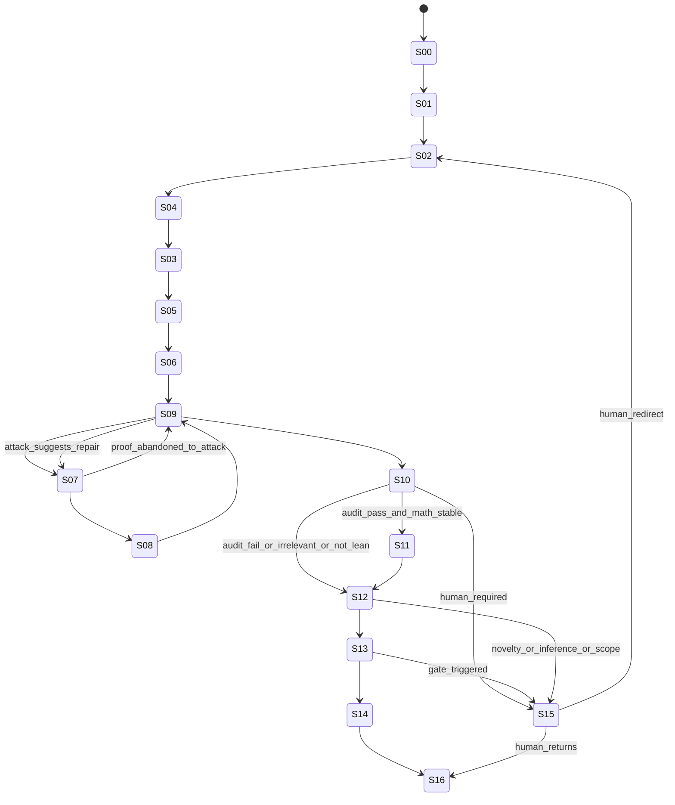

# 08 — Research-Cycle State Machine (System A ownership)

**Artifact ID:** `ART-08`  
**Owner:** System A · Research Discovery Assistant (ART-01D)  
**Version:** `ARCH-0.3-REPAIR-DUAL.1`  
**Normative status:** `OWNED_BY_DISCOVERY`  
**Home:** `architecture-discovery/` (DUAL.1 M4)

> **DUAL.1:** This FSM is **discovery** (idea→package). It does **not** mutate B ResearchState. Output = `CandidateResearchPackage` (ART-CRP). B persistence = ART-08d after intake.  
> **INCOMPATIBILITY WARNING:** Caller `math_stable`/`*_ok`/`hop_chain_ok` forbidden on B Commits (ART-06b).

## Purpose
Drive one-question **discovery** cycles that assemble CRPs. Adversarial/integration maturity lives in System B after intake.

## IO
**In:** locked question, pins, cards. **Out:** cycle ledger transitions S00–S16; invalid-transition rejects.

## Authority
Frontier Scheduler locks `S02`; Orchestrator drives transitions; Integration Auditor/EIO block promotions; human gates for scope.

## Failure modes
Skip S09/S10; proof-before-example; Lean-before-`math_stable`; inadmissible experiment entry; HEURISTIC UtilityCompat.

## Audit rules
Invalid-transition table hard reject; `math_stable` + S09 validation; `admissible_experiment` before S02; major_milestone blocks.

## Human gates
`MATH_STABLE_ACK`, `LIT_QUARANTINE_ACK`, `CX_CLASS_SKIP_ACK`, novelty/utility waivers as triggered; `RESEARCH_EXECUTION_START` before ResearchState writes.

## States

| State ID | Name | Exit criterion |
|----------|------|----------------|
| `S00` | IDLE / checkpoint restore | State ingestion complete |
| `S01` | STATE_INGESTION | Definitions, frontier, contradictions loaded; pins verified |
| `S02` | PROBLEM_SELECTION | Exactly one primary question ID locked |
| `S03` | CONJECTURE_FORMULATION | Formal hypothesis + falsification target registered |
| `S04` | MINIMAL_EXAMPLE | Analytic toy (≤2 candidates preferred) specified |
| `S05` | BASELINE_ANALYSIS | Homogeneous / known baseline instability recorded |
| `S06` | MECHANISM_SPEC | Mechanism schema filled **or** Phase A skip (I-CRP-02); `psi_data_dependence` set when mechanism present |
| `S07` | PROOF_ATTEMPT | Proof object or failed-proof entry recorded |
| `S08` | UTILITY_ANALYSIS | Typed utility claim or explicit “utility open” |
| `S09` | COUNTEREXAMPLE_ATTACK | Attack log with ≥1 mandatory attack class attempted |
| `S10` | INTEGRATION_AUDIT | Structured audit record PASS/FAIL/IRRELEVANT |
| `S11` | LEAN_DECISION | Status in Lean FSM set with refusal checklist |
| `S12` | RESULT_CLASSIFICATION | Epistemic label assigned via promotion transaction |
| `S13` | STATE_UPDATE | Committed append; indexes rebuildable |
| `S14` | NEXT_QUESTION | Frontier updated via single scheduler |
| `S15` | HUMAN_ESCALATION | Review packet emitted; cycle paused |
| `S16` | CYCLE_TERMINATION | Cycle ID closed; no silent reopen |

## Valid transitions

**Partial order (hard):** `S04 minimal example` before `S03 conjecture`; **pre-proof attack** `S06 → S09` before first `S07`; `S08` may return to `S09` for additional attacks; `S11` only if `math_stable`.

### `math_stable` predicate

True iff **all** hold:

1. Definition pins frozen this cycle  
2. Conjecture statement unchanged across **≥2** full attack+audit passes (first pass alone insufficient)  
   — **or** human `MATH_STABLE_ACK`  
3. No open contradiction on dependency closure  
4. ART-10 refusal checklist: **all required fields explicitly set** (not merely non-FAIL)  
5. Integration verdict ≠ FAIL on the latest pass  
6. `mechanism_family_checklist_ok` true (ART-14 predicate) **or** human `LIT_QUARANTINE_ACK`  
7. `utility_compat_resolved` true where resolved means UtilityCompat.`link_kind ∈ {PROVED_INEQUALITY, WAIVER_HUMAN}` **or** N/A-ack with `chain_segment=stability` — **not** HEURISTIC  
8. `hop_chain_ok` true: ExampleCard.`chain_link_intent` = FalsifierCard.`chain_segment` = frozen `quarantine[q_id].chain_link` (and cards still frozen)

**Additional invalid transition:** `S09 → S10` without S08 producing UtilityCompat (non-HEURISTIC) or explicit N/A-ack for stability-only cycles.  
**S09 validation (all required):**  
1. FalsifierCard has `refutation_type` ∈ enum  
2. each `mandatory_attack_classes[]` entry maps to exactly one `cx_id` in `attack_record_ids[]`  
3. each `attack_record_id` **is** a `cx_id` in the counterexample registry (ART-12) whose `construct` conforms to `witness_template`, **or** `construct=N/A` with human `CX_CLASS_SKIP_ACK` on that `cx_id` (skip still creates a registry row — never a free-floating non-`cx_id`)  
4. `attack_log_id` (canonical; alias `adversarial_attack_log_id`) resolves to the S09 log containing those records  
5. `mandatory_attack_classes[]` ⊇ ART-12 **applicable** set for this cycle’s `joint_law_family` / object (invalid S09 if applicable class omitted)

## Invalid transitions (hard reject)

| From → To | Why invalid |
|-----------|-------------|
| `S02` → `S03` | Conjecture before minimal example |
| `S02` → `S07` | Proof before conjecture |
| `S06` → `S07` | Proof before pre-proof counterexample attack |
| `S06` → `S09` without `mechanism_family_checklist_ok` **and** without `LIT_QUARANTINE_ACK` | Literature checklist bypass |
| `S06` → `S11` | Lean before proof/utility/attack/audit |
| `S07` → `S10` | Skipping counterexample attack |
| `S07` → `S12` | Classification without attack + audit |
| `S03` → `S12` | Result without experiment body |
| `S10` → `S11` without `math_stable` | Lean before math stable |
| Any → definition edit | Mid-cycle def change; must terminate + new pin cycle |
| `S10` FAIL → `S11` with LEAN_FULL intent | Formalizing rejected integration |
| Multiple `S02` locks | Violates one-question rule |
| `S14` without `S09` log with nonempty construct | Next-question without real attack |
| Research S01–S16 **writing ResearchState** before `RESEARCH_EXECUTION_START` | Design/research bleed |
| `S04` without ExampleCard.`chain_link_intent` = `quarantine.chain_link` | Hop intent mismatch at example |
| `S03` with FalsifierCard.`chain_segment` ≠ `quarantine.chain_link` | Hop-swap after S02 lock |
| `S03` with FalsifierCard.`chain_segment` ≠ ExampleCard.`chain_link_intent` | Card hop inconsistency |
| Mid-cycle edit of `quarantine[q_id]` after S02 lock | Frozen quarantine; must terminate + re-lock |
| Mid-cycle edit of ExampleCard.`chain_link_intent` or FalsifierCard.`chain_segment` after S04/S03 entry | Cards frozen after gate pass; terminate + re-lock |
| Promotion / `math_stable` with card segment ≠ frozen `quarantine.chain_link` | `math_stable` conjunct 8 + ART-06 `hop_chain_ok` + ART-11 Q16; fail-closed |
| Any promotion, frontier write (S14), or other ResearchState mutating commit while `ResearchState.hard_stop.active=true` | `I.HardStop` freeze (ART-06/15/24); audit/recovery + hard_stop set/clear only |
| — | Exception: `design_validation_only` traces may **simulate** FSM for architecture validation without committing ResearchState (ART-03) |

## Experiment readiness gate

Reject entering `S04` unless ExampleCard fields present:

1. Exact research question string  
2. Neighbor relation pin  
3. Target `cert_kind` intent  
4. Utility kind intent or explicit N/A for later  
5. Falsification criterion **intent** (full FalsifierCard at S03)  
6. Chain segment **intent** = `quarantine[q_id].chain_link` (ExampleCard.`chain_link_intent`)  
7. Gap regime / toy Λ description  

**Do not** require formal conjecture hypothesis to enter S04 — that is S03 after ExampleCard.

## Invariants

- One primary question per cycle ID
- Counterexample attack cannot be marked “skipped”
- Integration audit can reject as `IRRELEVANT` even if locally correct
- Human / budget / system interrupt: while `ResearchState.hard_stop.active=true`, promotions, frontier writes (S14), and other ResearchState mutating commits fail-closed (`I.HardStop`; ART-06/15/24). Resume only via `HARD_STOP_RELEASE`.

## Failure modes

- Rubber-stamp `S09` with empty attack
- Mid-cycle redefining \(F_D\) to dodge counterexample
- Promoting on `S07` success alone

## Audit rules

Cycle ledger must show ordered state timestamps; missing `S09` or `S10` blocks **major milestone** promotion (`ART-01` `major_milestone` predicate).  
`admissible_experiment(cycle_id)` (ART-01) required before `S02` lock; false → hard reject.  
`S02` lock also requires `quarantine[q_id]` row with valid classifier + `chain_link` (ART-01/06); Frontier Scheduler records classifier on lock; row **frozen** until cycle end.  
`S04`: ExampleCard.`chain_link_intent` = `quarantine.chain_link`.  
`S03`: FalsifierCard.`chain_segment` = `quarantine.chain_link` (= intent).
