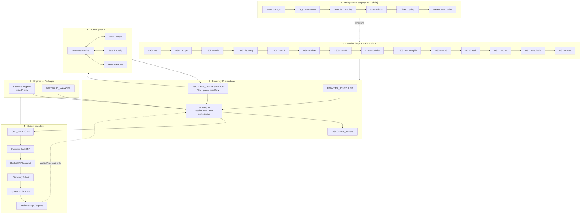
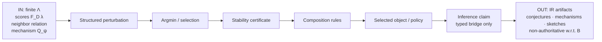
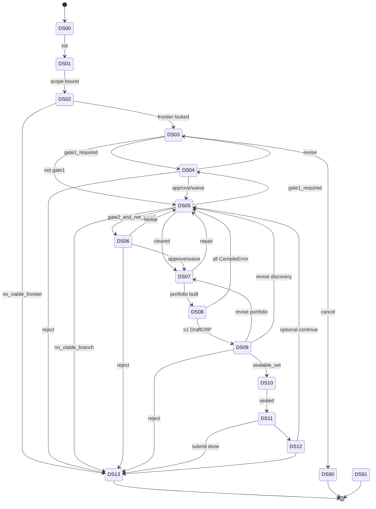
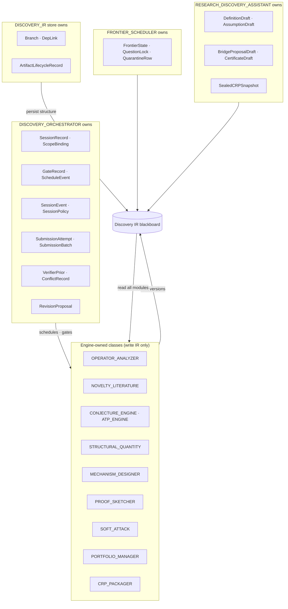
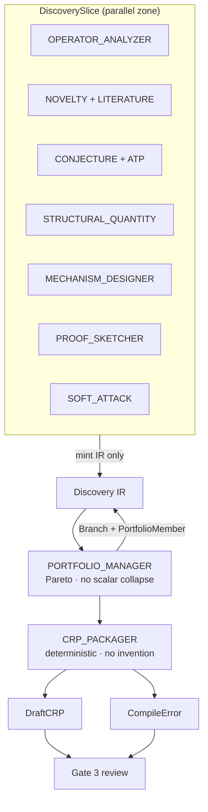
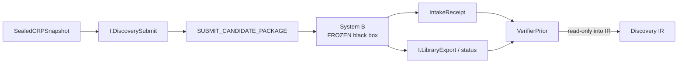

# Discovery (System A) — Architecture Information Flow

**Purpose:** Explain how information moves through System A (Discovery) — not how to implement it.  
**Package:** `ARCH-0.3-REPAIR` · **DUAL.2**  
**Normative status:** Narrative companion to frozen ART-A-00…A-07  
**Charter:** [ART-01D](../architecture_verifier/01-charter/CHARTER_DISCOVERY.md)  
**Canvas:** [discovery-information-flow](/Users/nicholasmino/.cursor/projects/Users-nicholasmino-Desktop-Research-Work/canvases/discovery-information-flow.canvas.tsx)

> **System A invents and packs; System B certifies.** Sole write into B = sealed CRP via `I.DiscoverySubmit` → `SUBMIT_CANDIDATE_PACKAGE`. Intake ≠ mathematical truth. Soft Attack ≠ B counterexample.

**Related guides:** [System B flow](../architecture_verifier/ARCHITECTURE_INFORMATION_FLOW.md) · [A↔B bridge](../architecture-visual/DISCOVERY_VERIFIER_INFORMATION_FLOW.md) · canvas `discovery-information-flow.canvas.tsx`

---

## 0. How to read this document

1. **Big picture** — one flowchart of the whole discovery session (sections labeled A–F).  
2. **Each section** — its own flowchart plus **IN / OUT / WHO / STORE**.  
3. Arrows mean *information or control*, not code calls.

| Symbol | Meaning |
|--------|---------|
| **IN** | What must exist before this section runs |
| **OUT** | What this section produces |
| **WHO** | Module or role that may write or veto |
| **STORE** | Where durable artifacts land |

**Hard rules (surface everywhere):**

| Rule | Meaning |
|------|---------|
| Orchestrator ≠ math | `DISCOVERY_ORCHESTRATOR` owns FSM/workflow only; never invents mathematics |
| Assistant seals | `RESEARCH_DISCOVERY_ASSISTANT` seals CRPs; does not own session FSM |
| Packager purity | `CRP_PACKAGER` is deterministic IR→CRP; invents nothing at pack time |
| Soft Attack ≠ CX | Soft Attack writes IR drafts only; never `RECORD_COUNTEREXAMPLE` |
| Intake ≠ truth | B intake creates authoritative intake record only; not certification |
| Parallel engines | Only inside `DiscoverySlice` between barriers (ART-A-03 I-A03-06) |
| Waivers | Session-scoped, gate-specific; never waive B `admissible_package` |

---

## 1. Big picture — labeled sections



**Section map**

| ID | Name | One-line job |
|----|------|----------------|
| **A** | Math problem scope | Same finite-candidate perturbation chain; A invents, does not certify |
| **B** | Session lifecycle | DS00→DS13 FSM: init → scope/frontier → discovery/refine → gates → portfolio → draft → seal → submit → feedback → close |
| **C** | Discovery IR | Session blackboard; engines write IR; Orchestrator owns FSM |
| **D** | Engines & portfolio | Specialist engines mint IR; Portfolio → Packager → DraftCRP |
| **E** | Human gates | Gates 1–3 review packets; session-scoped waivers |
| **F** | Submit boundary | Seal → `I.DiscoverySubmit` → sole B write; read-only priors back |

---

## 2. Section A — Mathematical problem scope

System A works within the same Area-1 scientific program as System B. Discovery **invents** candidates along this chain; it does **not** certify them.



| | |
|--|--|
| **IN** | Finite candidate set Λ; scores \(F_D(\lambda)\); neighbor pin; mechanism \(Q_\psi\) with explicit data-dependence flag; human scope binding (Area-1) |
| **OUT** | Engine-owned IR: `OperatorAnalysis`, `ConjectureCandidate`, `MechanismProposal`, `ProofSketch`, `StructuralQuantity`, literature/novelty assessments — all session-local, non-authoritative |
| **WHO** | Specialist engines invent; Soft Attack proposes rewrites; Orchestrator schedules only; human gates on scope/objective shifts |
| **STORE** | Discovery IR (`ArtifactVersion` per class owner); **not** B `ResearchState` |
| **Must not** | Certify, promote, demote, mint authoritative CX, close proof obligations, write B ControlState |

---

## 3. Section B — Session lifecycle (DS00→DS13)

`DISCOVERY_ORCHESTRATOR` is the **sole** FSM control owner. Executing modules never advance the FSM.



### Phase IO cards

#### Init / scope / frontier (DS00–DS02)

| | |
|--|--|
| **IN** | Authorized open request; human Area-1 scope; ART-08b frontier candidates |
| **OUT** | `SessionRecord`, `ScopeBinding`, `FrontierState`, `QuestionLock`, `QuarantineRow` |
| **WHO** | Orchestrator (control); Frontier Scheduler executes frontier lock |
| **STORE** | Discovery IR + append-only `SessionEvent` log |

#### Discovery & refinement (DS03, DS05)

| | |
|--|--|
| **IN** | Locked question; IR snapshot at slice open (`input_snapshot_digest`) |
| **OUT** | Engine-owned IR versions; `DiscoverySlice` completion records; evaluated `gate1_required` / `gate2_required` |
| **WHO** | Orchestrator opens/closes slices; engines execute scheduled invocations only |
| **STORE** | Discovery IR; `SessionEvent` (slice payloads) |
| **Parallel rule** | Engines run in parallel **only** inside an open `DiscoverySlice`; barrier before FSM predicate evaluation |

#### Portfolio & draft (DS07–DS08)

| | |
|--|--|
| **IN** | Refined IR tips; Gate 1 cleared; Gate 2 cleared or skipped |
| **OUT** | `PortfolioFrontier`, `PortfolioMember`, `Branch`; per-member `DraftCRP` or `CompileError` |
| **WHO** | Portfolio Manager builds frontier; Packager compiles deterministically |
| **STORE** | Discovery IR (`Branch` via DISCOVERY_IR store) |
| **Ordering** | Portfolio → compile **all** Gate-3 candidates **before** Gate 3 (I-A02-11) |

#### Seal / submit / feedback / close (DS10–DS13)

| | |
|--|--|
| **IN** | Gate 3 `seal_set` of successful `DraftCRP.version_id`s |
| **OUT** | `SealedCRPSnapshot`; `SubmissionBatch` + `SubmissionAttempt`; optional `VerifierPrior`; `SessionClosed` with `close_reason` |
| **WHO** | Assistant seals and submits; Orchestrator ingests feedback as priors |
| **STORE** | Discovery IR; workflow records only in Orchestrator-owned classes |
| **Terminal** | DS13 orderly closure (any `close_reason`); DS90 cancel; DS91 infrastructure allowlist only |

---

## 4. Section C — Discovery IR blackboard + module ownership



| | |
|--|--|
| **IN** | Mint requests from class owners; structural persistence requests; lifecycle transition authorizations |
| **OUT** | Durable session-local IR: immutable `ArtifactVersion` payloads + append-only lifecycle |
| **WHO** | Class owner mints versions; DISCOVERY_IR persists structure; Orchestrator mints workflow envelopes only |
| **STORE** | Session-local Discovery IR (never B authoritative state) |
| **Must not** | In-place `version_id` mutation; cross-session IR sharing (priors via explicit import only) |

**Ownership highlights**

| Artifact class | Owner |
|----------------|-------|
| Workflow (`SessionEvent`, `GateRecord`, `VerifierPrior`, …) | DISCOVERY_ORCHESTRATOR |
| Structure (`Branch`, `DepLink`, lifecycle) | DISCOVERY_IR |
| Frontier (`FrontierState`, `QuestionLock`) | FRONTIER_SCHEDULER |
| Math content (conjectures, mechanisms, sketches, …) | Respective engine or Assistant |
| `DraftCRP` / `CompileError` | CRP_PACKAGER |
| `SealedCRPSnapshot` | RESEARCH_DISCOVERY_ASSISTANT |

---

## 5. Section D — Engines & Portfolio → CRP_PACKAGER → DraftCRP



| | |
|--|--|
| **IN** | Package-coherent `Branch` tip pins; closed acyclic `DepLink` closure; `profile_hint` per portfolio member |
| **OUT** | One `DraftCRP` or one `CompileError` per `compile(branch_id)`; portfolio metadata (novelty/survivability estimates — advisory only) |
| **WHO** | Engines invent math into owned classes; Portfolio Manager assembles distinct directions; Packager projects only |
| **STORE** | `PortfolioFrontier`, `PortfolioMember`, `DraftCRP`, `CompileError` in Discovery IR |
| **Must not** | Packager fill gaps; Portfolio invent mathematics; scalar ranking collapse |

**Projection map (Packager → CRP payload)**

| CRP field | IR source |
|-----------|-----------|
| `definitions[]` | `DefinitionDraft` |
| `assumptions[]` | `AssumptionDraft` |
| `claims[]` | `TheoremCandidate`, `ConjectureCandidate` |
| `proof_sketches[]` | `ProofSketch` |
| `mechanism_proposals[]` | `MechanismProposal` (if profile requires) |
| `falsifiers[]` | `FalsificationTarget`, `SoftFalsifierDraft` |
| `declared_reads[]` | `VerifierPrior` / library digests |

Missing required content ⇒ `CompileError`, not invention.

---

## 6. Section E — Human gates 1–3 + waivers

```mermaid
flowchart TB
  OrchE[DISCOVERY_ORCHESTRATOR] -->|review packet| HumE[Human researcher]
  HumE -->|approve / revise / reject / defer / waive| OrchE

  subgraph G1box["Gate 1 — scope / operator / objective"]
    G1E[GateRecord + ScopeBinding version]
  end

  subgraph G2box["Gate 2 — novelty quarantine"]
    G2E[GateRecord]
  end

  subgraph G3box["Gate 3 — seal set"]
    G3E[GateRecord.seal_set<br/>DraftCRP.version_id[]]
  end

  OrchE --> G1box
  OrchE --> G2box
  OrchE --> G3box
```

| Gate | Trigger | Human sees | On approve/waive |
|------|---------|------------|------------------|
| **1** | `gate1_required`: scope, operator class, or objective shift | Scope delta + operator analysis | New `ScopeBinding` version → DS05 |
| **2** | `gate2_required`: novelty quarantine | Novelty assessments + literature graph | → DS07 portfolio path |
| **3** | All Gate-3 candidates compiled | Portfolio metadata + all `DraftCRP`s + `CompileError`s | Explicit nonempty `seal_set` → DS10 |

| | |
|--|--|
| **IN** | `GateRequest` packet (digest of inputs; refs to scope, novelty, drafts, errors) |
| **OUT** | `GateRecord` with decision; Gate 3 adds `seal_set` when complete |
| **WHO** | Human decides; Orchestrator records and commits FSM transition |
| **STORE** | `GateRecord`, `SessionEvent`; optional `SessionPolicy` for deterministic Gate-3 waiver |
| **Waiver rule** | Session-scoped, gate-specific; **never** waives B `admissible_package`; Gate 3 waiver must resolve to explicit nonempty successful `DraftCRP` ids |

---

## 7. Section F — Submit boundary



| | |
|--|--|
| **IN** | `SealedCRPSnapshot` for each `DraftCRP.version_id` in Gate 3 `seal_set`; `SubmissionBatch` bound to `GateRecord` |
| **OUT** | B `IntakeReceipt` (authoritative intake only); read-only exports/status; A `VerifierPrior` citing `sealed_digest` and/or `receipt_ref` |
| **WHO** | Assistant executes `I.DiscoverySubmit`; Orchestrator mints `VerifierPrior` on authorized import |
| **STORE** | `SubmissionAttempt` (per-package idempotency); `VerifierPrior` in Discovery IR |
| **Sole B write** | `SUBMIT_CANDIDATE_PACKAGE` — no other B ResearchState/ControlState mutation |

**Batch / retry rules**

- One `SubmissionBatch` per Gate-3 seal wave.  
- Retry reuses `idempotency_key`; does not recreate Draft/Seal/Gate3.  
- Members already `ACCEPTED_DRAFT` are not resubmitted on partial retry.  
- Transport failure ≠ B intake rejection.  
- Material IR change ⇒ new draft → Gate 3 → seal → new logical submission.

**Late feedback**

- Open session: DS12 may mint active `VerifierPrior` with provenance.  
- Closed session (DS13): never reopens; late feedback seeds **new** session via authorized import.  
- Receipts are never certification/promotion authority.

---

## 8. Authority when things conflict

```text
Human gate decision
  → Charter (ART-01D)
  → Frozen ART-A-00…A-07
  → Package coherence predicates (P-A04-COH-*)
  → Portfolio advisory estimates (non-authoritative)
  → VerifierPrior (non-authoritative w.r.t. B math truth)
```

Orchestrator does not pick mathematical truth. Humans may force via `GateRecord`. Competing IR versions remain until explicitly abandoned or selected into a portfolio branch.

---

## 9. Relation

| Artifact | Role |
|----------|------|
| ART-A-00 | Overall architecture (primary diagram) |
| ART-A-02 | Module ownership & IR contracts |
| ART-A-03 | FSM states DS00–DS13, DS90/91 |
| ART-A-04 | Field schemas & predicates |
| ART-A-05 | DiscoverySlice invocation execution |
| ART-A-06 | Projection, seal, submit batch rules |
| ART-A-07 | Persistence & replay |
| ART-01D | Charter boundary |
| ART-CRP | CRP intake schema (read-only for A) |
