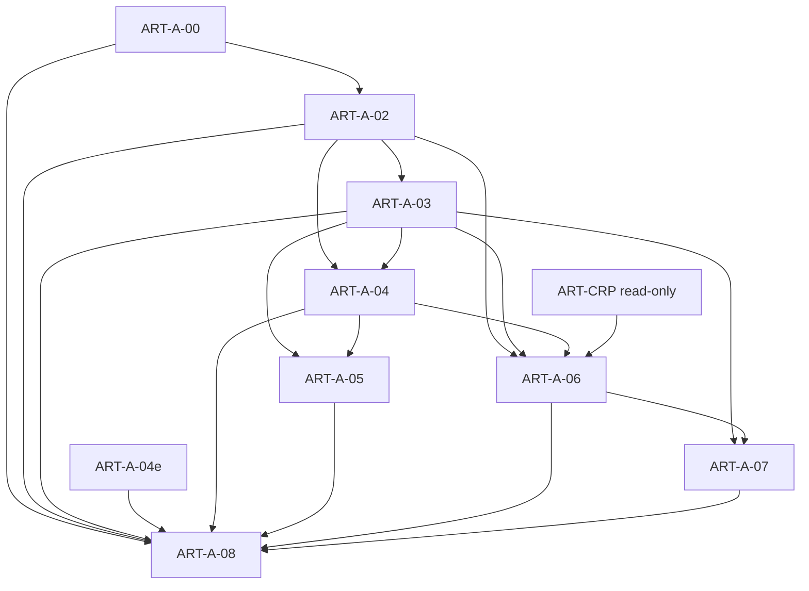

# Architecture Matrices

## Dependency graph

## Module → artifact ownership

See ART-A-02 §1.4 (authoritative). Amendments: SessionEvent, SessionPolicy, SubmissionAttempt, **SubmissionBatch** → DISCOVERY_ORCHESTRATOR.

## Interface matrix

| Interface | Direction | Norm |
|-----------|-----------|------|
| I.DiscoverySubmit | A→B | A-06 / ART-CRP |
| I.DiscoveryStatus | A←B | read-only |
| I.LibraryExport | A←B | read-only → VerifierPrior |
| Human Gate 1/2/3 | Human↔A | A-03 |
| Engine invocation | Orch→engines | A-05 |

## FSM transition matrix (summary)

Authoritative: ART-A-03 Mermaid + state tables. Key edges: DS05→DS04; DS07 only if ¬gate1; DS08 before DS09; DS09→DS10 iff sealable_set_nonempty; DS13 orderly; DS91 allowlist.

## A/B interaction matrix

| Action | Allowed? |
|--------|----------|
| SUBMIT_CANDIDATE_PACKAGE via I.DiscoverySubmit | Yes (sealed only) |
| LibraryExport / status / receipts import | Read-only |
| RECORD_COUNTEREXAMPLE / APPLY_PROMOTION / LOCK_CYCLE from A | No |
| Soft Attack as authoritative CX | No |
