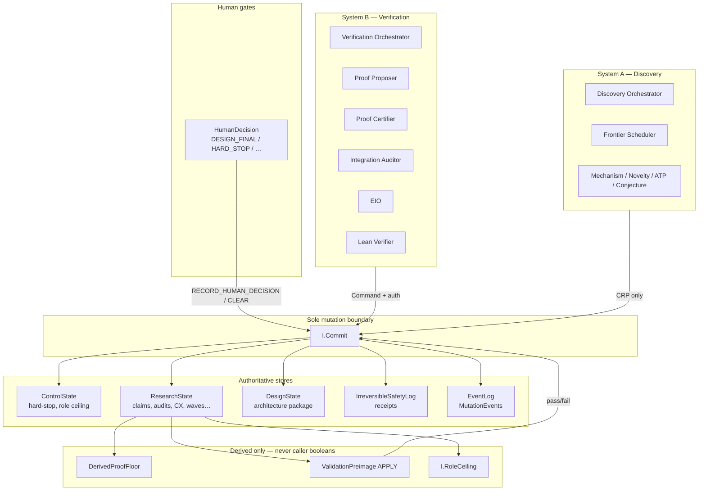
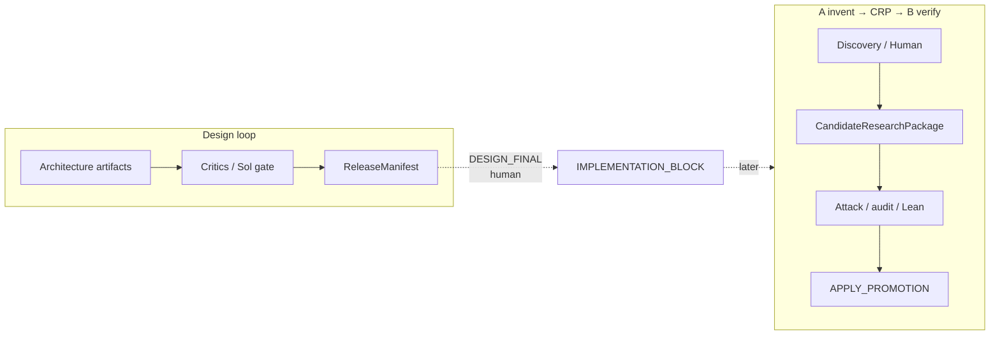
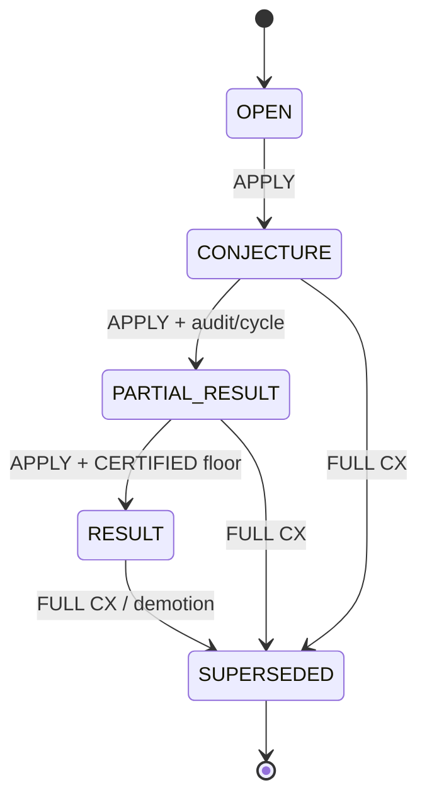
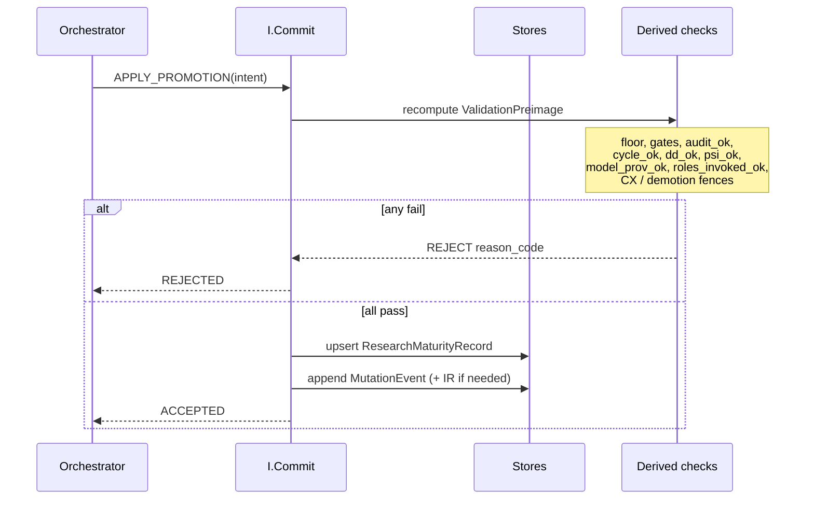
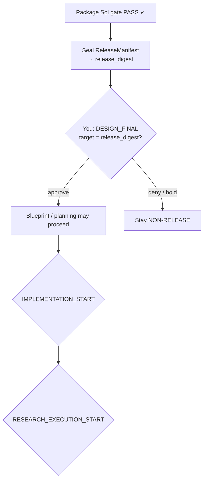

# General architecture (big picture)

**What this is:** A dual-system design — **A** invents and packs research; **B** verifies, attacks, certifies, and promotes — joined only by `CandidateResearchPackage`. Agents may propose; only authenticated **`I.Commit`** mutates B state.

**What it is not (yet):** A shipping product. Package is `NON-RELEASE`; implementation and research execution stay blocked until you approve human gates.

See also: [18-dual-system-separation](18-dual-system-separation.md).

---

## 1. One sentence

> Agents may **propose**; only authenticated **`I.Commit`** may mutate authoritative state; promotion requires intent + derived proofs + audit/cycle/provenance fences; humans hold the master gates.

---

## 2. System at a glance

---

## 3. Dual loop (design vs research)

Design freezes *how the system works*. Research freezes *what claims are believed*. They share Commit discipline but different stores.

---

## 4. Claim lifecycle (happy path)

Maturity axis ≠ proof floor. You can be `RESULT` only if `DerivedProofFloor = CERTIFIED_INFORMAL`.

---

## 5. Promotion pipeline (major milestone)

---

## 6. Where authority lives (cheat sheet)

| Concern | Authoritative artifact |
|---------|------------------------|
| Objects / digests | ART-07b |
| Certs / bridges | ART-07c |
| Mutation / hard-stop | ART-06b |
| Identity / roles | ART-04c + ART-04d |
| Promotion | ART-13b |
| Audit | ART-11b |
| Provenance (DD/model) | ART-11c |
| Cycle bind | ART-08d |
| Lean | ART-10b |
| Demotion | ART-16b |
| Checkpoint | ART-17b |
| Conformance H/canon | ART-21b |
| Release identity | ART-25b |

Appendix / descriptive files (old FSMs, ART-04b profile prose, ART-21 historical T-suite) are **not** authority when an ACTIVE_NORMATIVE `*b/*c/*d` binding exists.

---

## 7. Human gates that matter now

---

## Next

Browse [README.md](README.md) section docs for zoomed-in charts.
