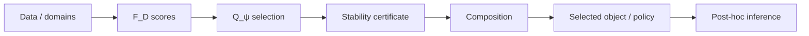
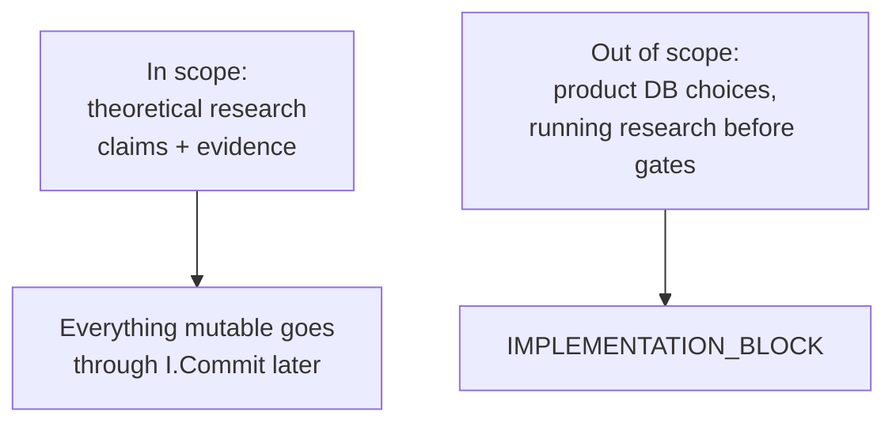
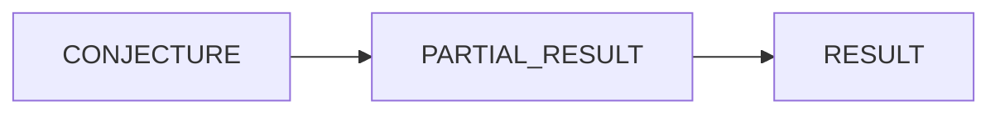

# 01 — Charter & math scope

**Normative:** `architecture/01-charter/CHARTER.md`, `architecture/02-scope/MATH_SCOPE.md`

## Plain English

The charter says *what the system is allowed to care about*. Math scope locks the scientific chain (data → scores → selection → certificates → inference) and default finite Λ.

---

## Scope chain

Non-finite Λ needs a `CONTINUOUS_LAMBDA` human gate.

---

## Charter boundaries

---

## Major milestone targets

Only these maturity raises count as *major* for audit/cycle binds:

