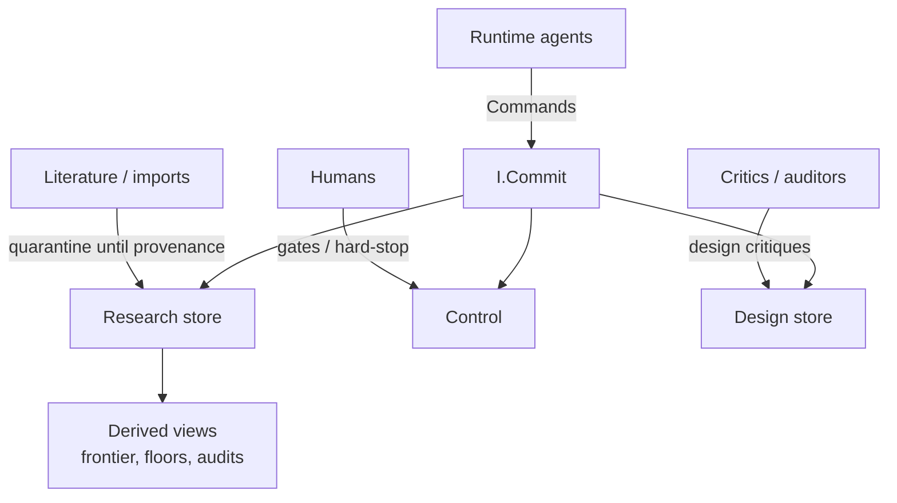
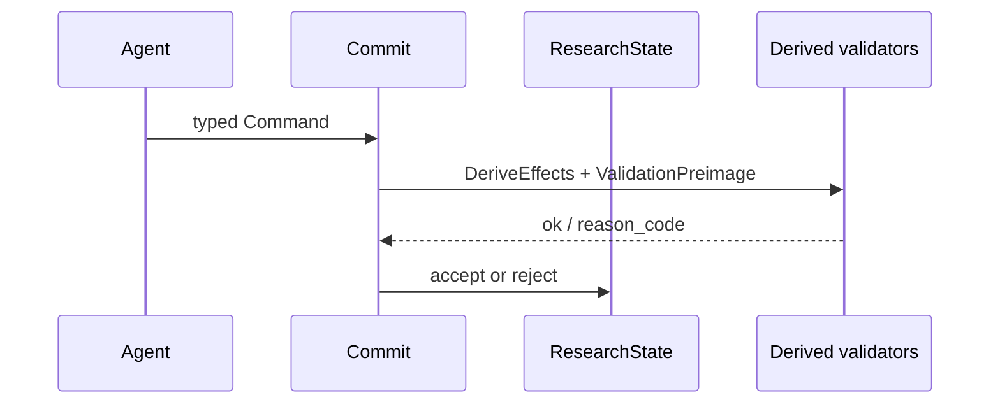

# 02 — System context

**Normative / narrative:** `architecture/03-context/SYSTEM_CONTEXT.md` · info-flow: `architecture/ARCHITECTURE_INFORMATION_FLOW.md`

## Plain English

Two worlds: **design** (how the architecture is written) and **research** (claims inside the machine). Both talk to humans and external literature, but research cannot silently write itself.

---

## Context diagram

---

## Information flow (simplified)

