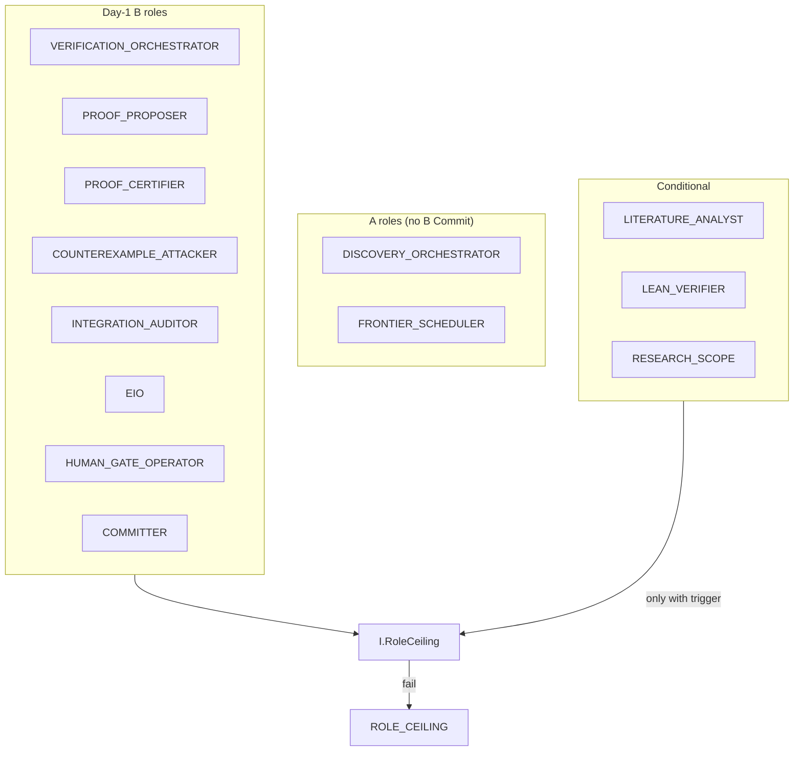
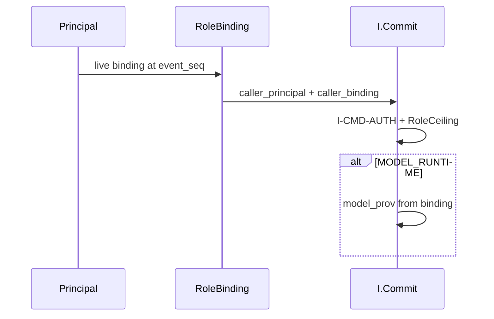
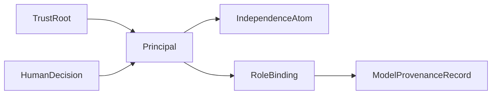

# 03 — Agents, identity, operable minimal

**Normative:** `ART-04c` identity · `ART-04d` operable binding  
**Appendix:** `ART-04b` profile prose · `AGENT_ROLES.md` labels

## Plain English

Every write has a **principal** and a **role binding**. Day-1 only a small roster can act; extras need triggers or a `ROLE_EXPANSION` human gate.

---

## Day-1 roster

**Hard rule:** proposer ≠ certifier (same principal cannot wear both live).

---

## Auth path

---

## Identity objects

