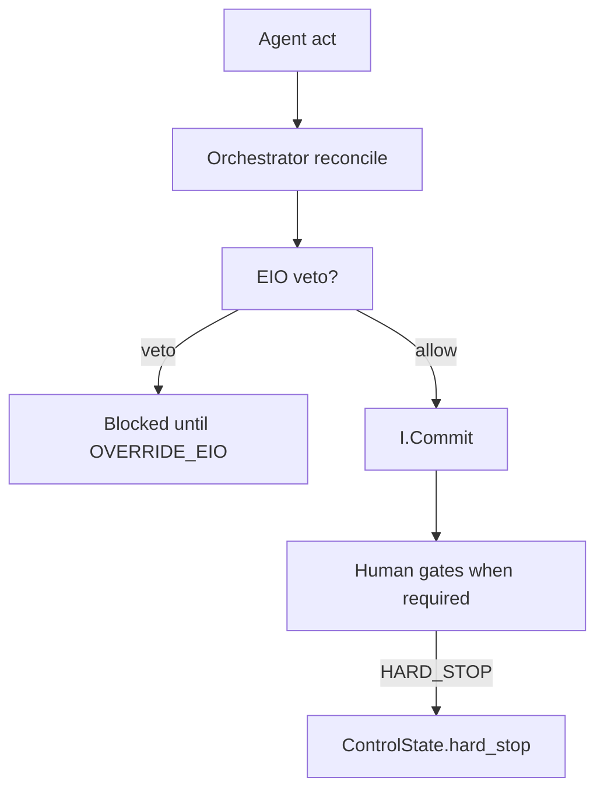
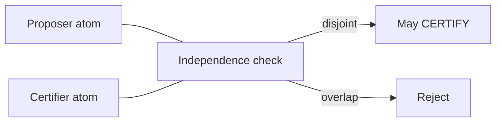

# 04 — Authority & escalation

**Normative / partial:** `architecture/05-authority/AUTHORITY_MATRIX.md`

## Plain English

Who can overrule whom. EIO can veto dishonest provenance/pin/gate claims. Humans sit above agents. Critics do not write research state.

---

## Escalation ladder

---

## Independence (certify)

