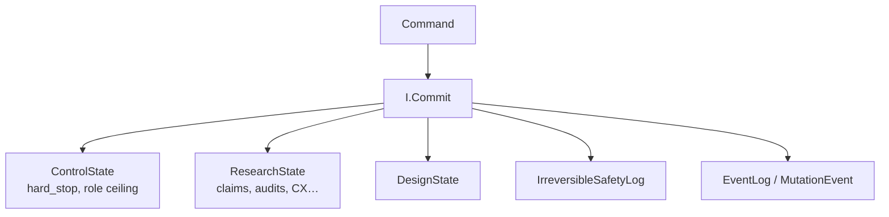
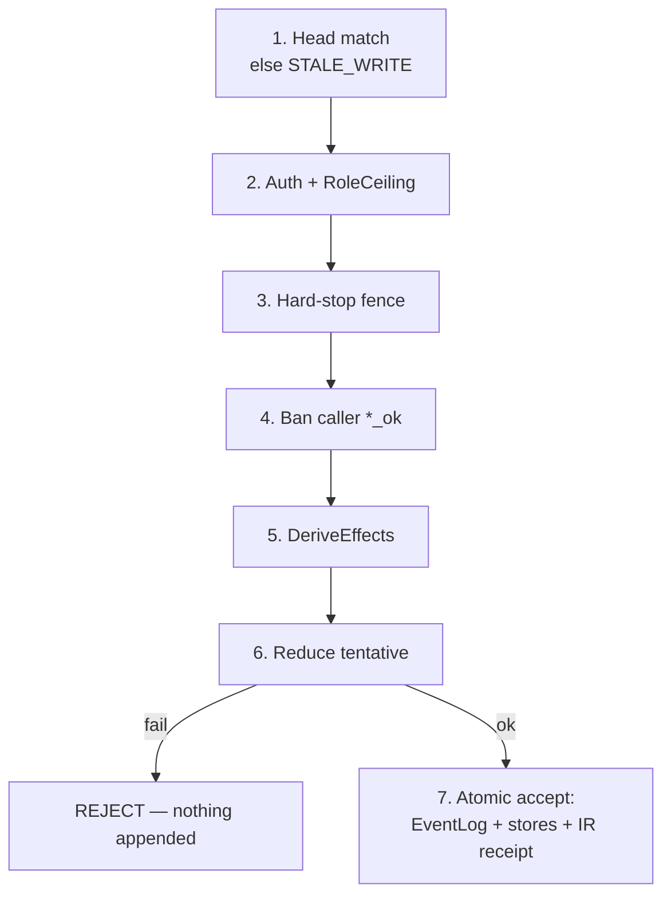
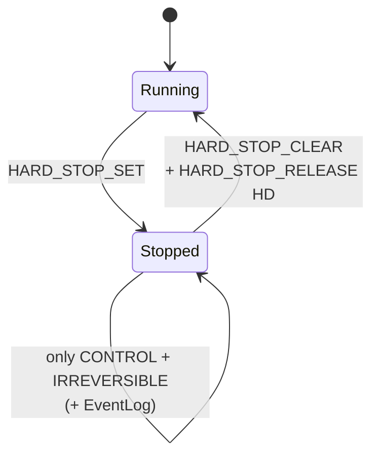
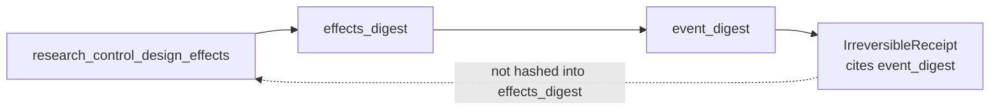

# 05 — Mutation & authoritative state

**Normative:** `ART-06b` `MUTATION_AND_AUTHORITATIVE_STATE.md`

## Plain English

Nothing important is true because an agent said so. The only mutator is **`I.Commit`**. Four stores move together in one atomic accept.

---

## Stores

---

## Commit pipeline

---

## Hard-stop

While stopped: no research object upserts (provenance writers blocked).

---

## Digest cycle (irreversible)

