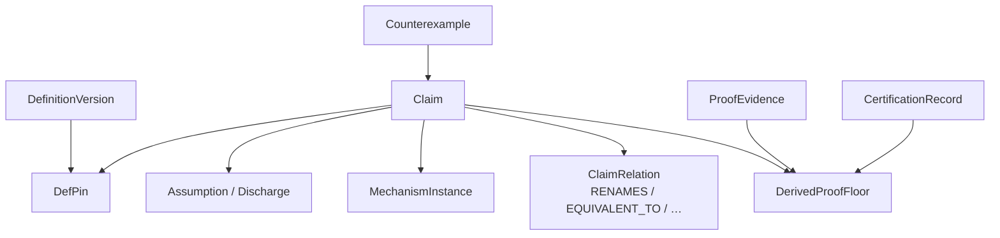
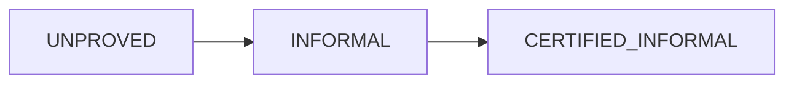
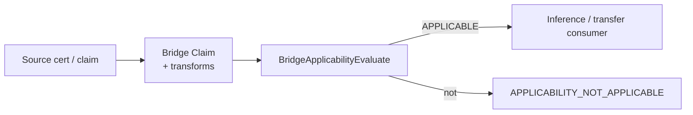
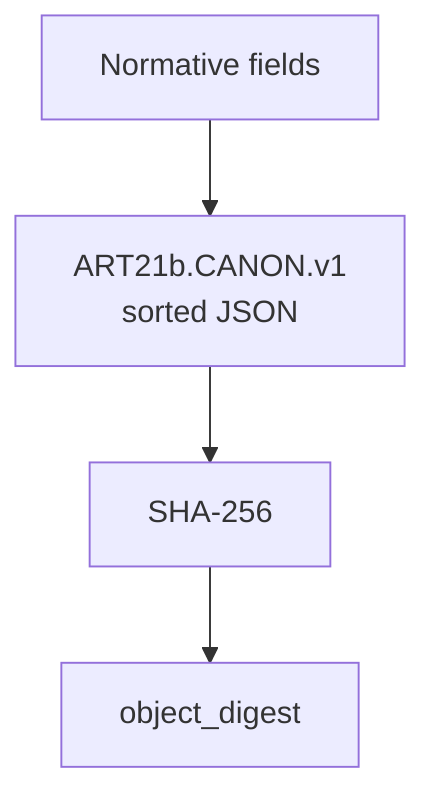

# 06 — Objects, certificates, bridges

**Normative:** `ART-07b` canonical objects · `ART-07c` typed certs/bridges · digests: `ART-21b`

## Plain English

Everything important is a **digest**. Claims carry pins, assumptions, domains. Certificates and bridges are typed Claims — not free labels.

---

## Object map (core)

---

## Proof floor ladder

Lean (`LEAN_REF`) can yield INFORMAL when FULL/CORE — it cannot launder into CERTIFIED without real certify.

---

## Bridge use

---

## Hashing

