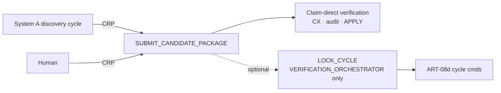
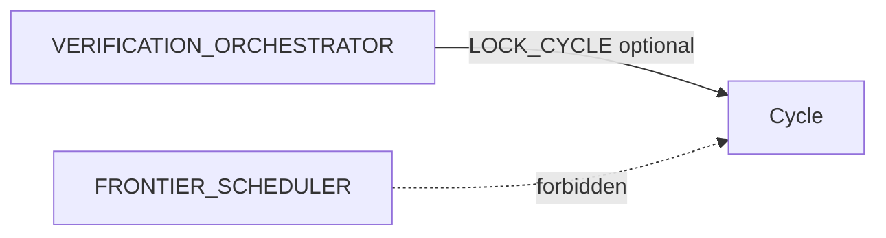

# 07 — Research cycle (visual)

Companion to ART-08d (B) and `architecture-discovery/` ART-08 (A).

## Dual path

## Who locks B cycles

Frontier selects questions **only inside System A**. It never locks or controls verifier cycles.
