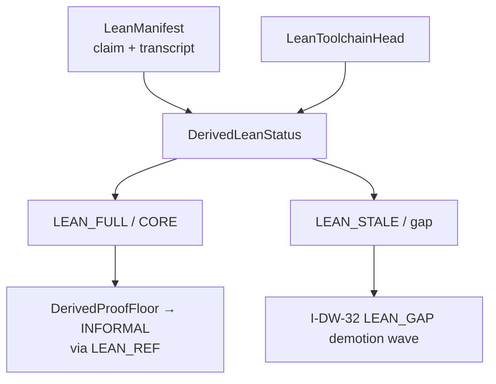
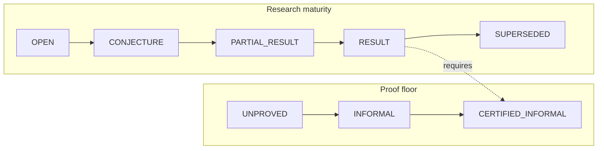
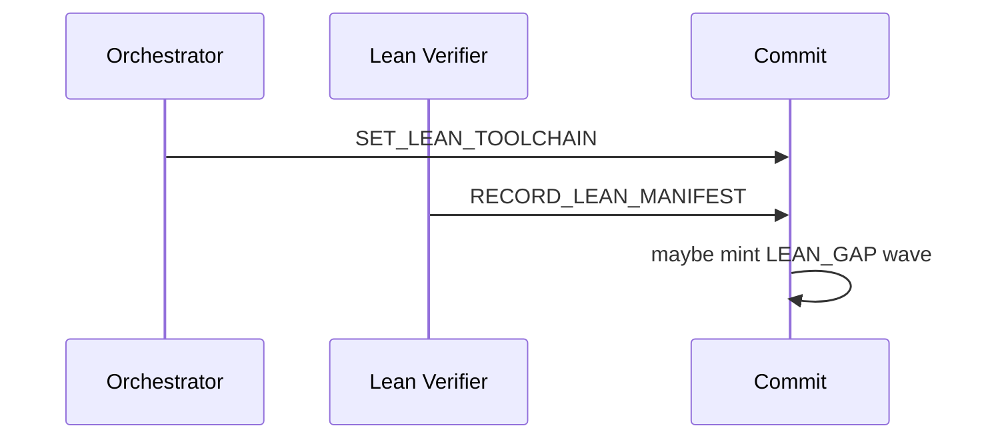

# 08 — Lean & theorem status

**Normative:** `ART-10b` Lean binding · maturity via `ART-13b`  
**Appendix:** ART-09 / ART-10 FSM sketches

## Plain English

Lean status is **computed** from a claim-bound manifest + toolchain — never a free label. Lean evidence is INFORMAL-grade for floor purposes; RESULT still needs CERTIFIED.

---

## Lean status (derived)

---

## Status axes (two dials)

---

## Commands

