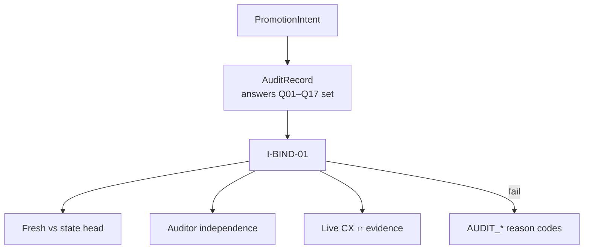
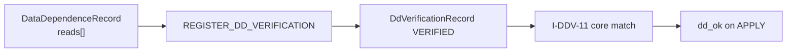
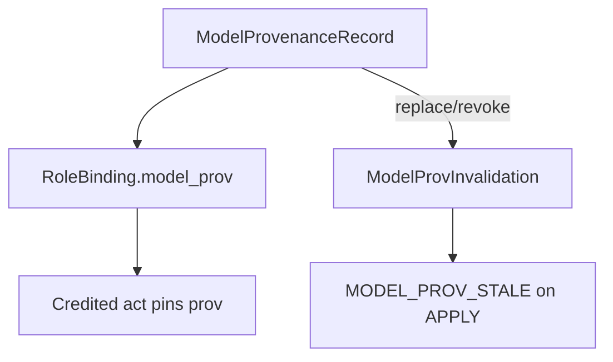
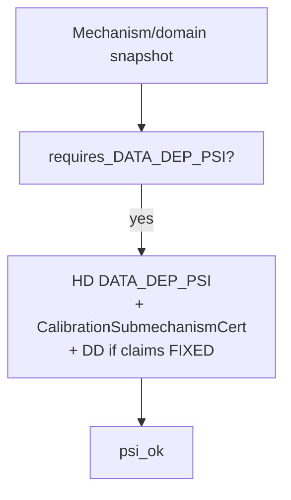

# 09 — Audit & provenance

**Normative:** `ART-11b` audit binding · `ART-11c` provenance binding

## Plain English

Major promotions need an **intent-bound audit** with fixed questions. Data-independence needs a **VERIFIED** DD record. Model swaps invalidate old credited acts.

---

## Audit bind

Q04 is not attestation-alone — it follows ART-11c (`I-Q04-01`).

---

## DD verification

FIXED ⇒ empty reads; hidden declared reads ⇒ `DD_HIDDEN_READ`.

---

## Model provenance

---

## ψ / DATA_DEP_PSI

