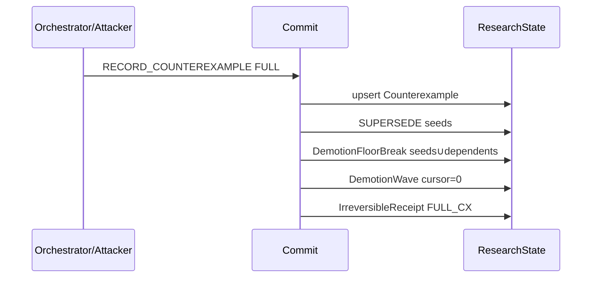
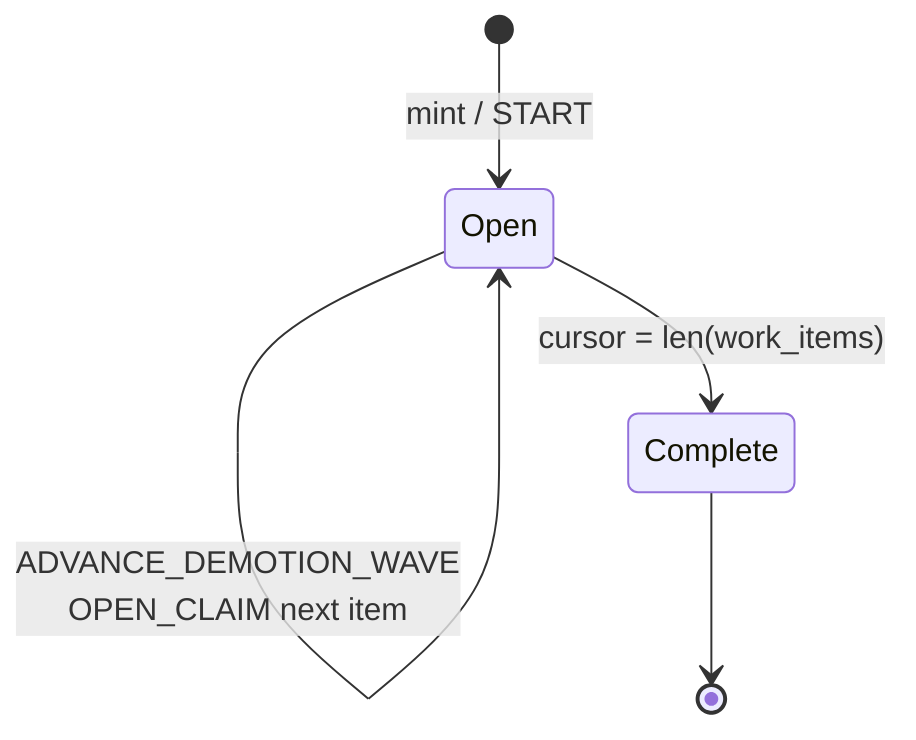
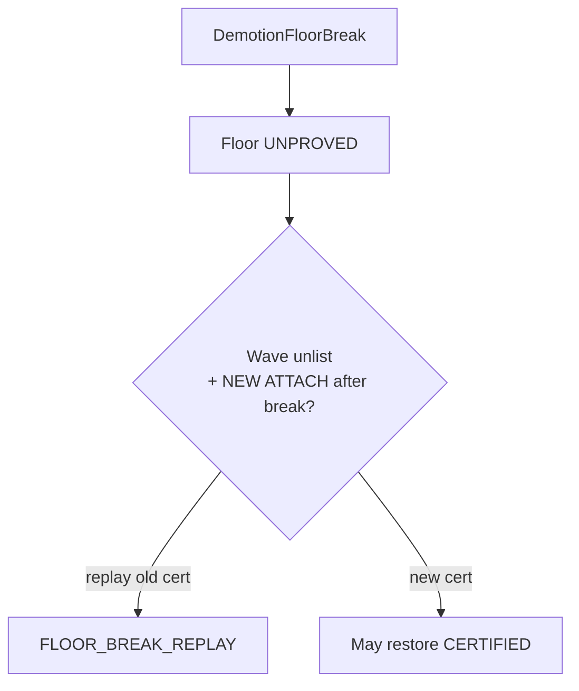
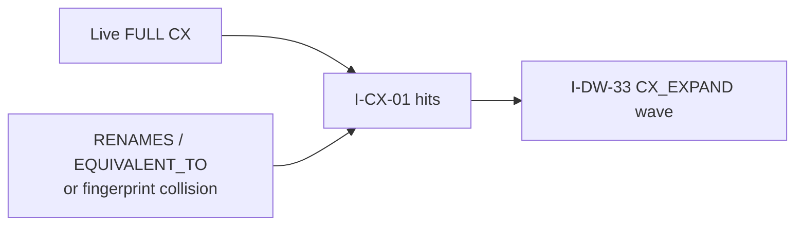

# 10 — Counterexamples & demotion

**Normative:** `ART-16b` demotion waves · CX objects in ART-07b · protocol labels in ART-12 (migrating)

## Plain English

A **FULL** counterexample supersedes hit claims in the **same Commit**, breaks proof floors for seeds and queued dependents, and opens a durable demotion wave so crashes can resume.

---

## FULL CX mint

---

## Wave advance

Incomplete wave ⇒ `DEMOTION_WAVE_OPEN` on non-noop APPLY.

---

## Floor break (no cert replay)

---

## Closure growth

