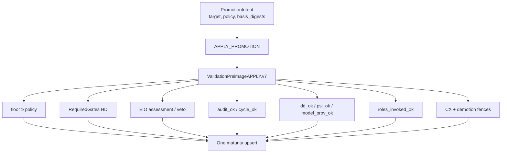
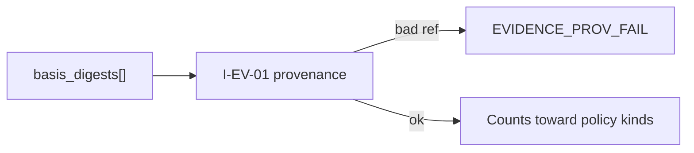
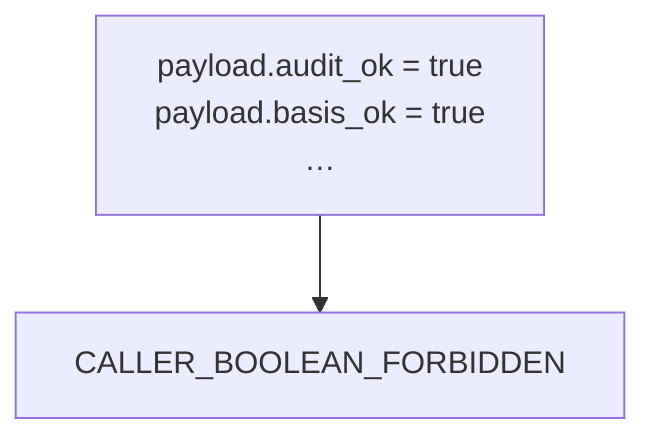

# 11 — Promotion

**Normative:** `ART-13b` `PROMOTION_INTENT.md`

## Plain English

Raising research maturity is a **proof-carrying Commit**. The intent is content-addressed; every `*_ok` in the validation preimage is recomputed — never trusted from the caller.

---

## APPLY flow

---

## Basis = evidence refs

---

## Forbidden shortcuts

