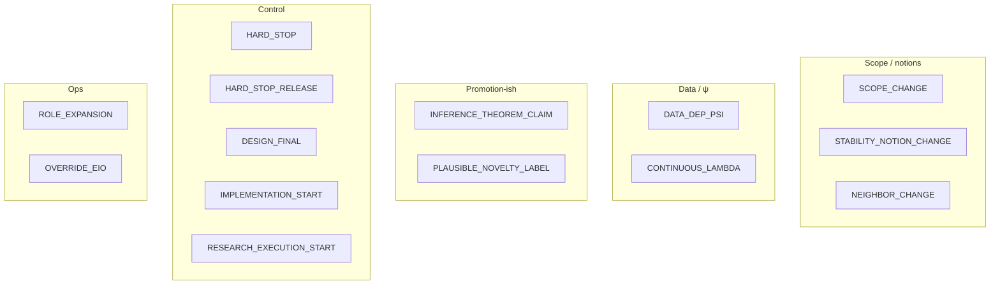
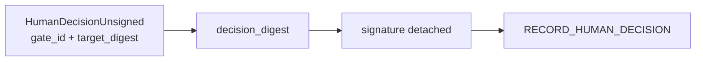
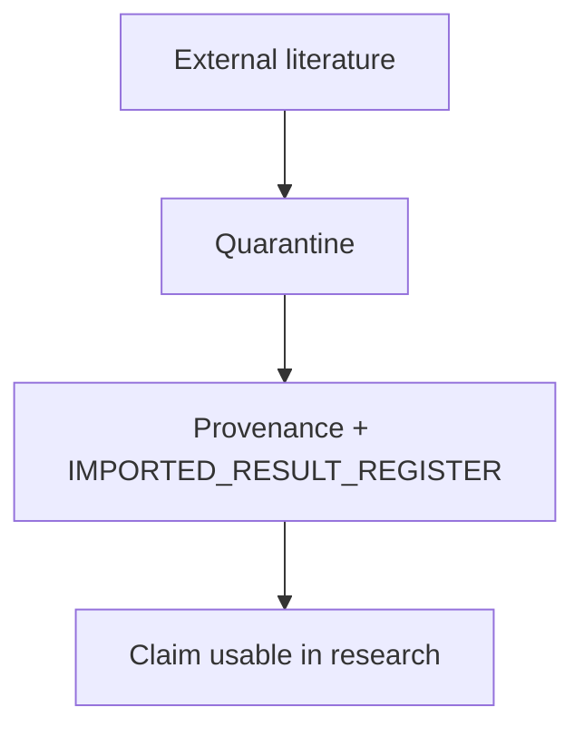

# 12 — Human gates & literature

**Normative / partial:** `ART-15` human gates · `architecture/14-literature/LITERATURE_BOUNDARY.md`

## Plain English

Humans approve the scary transitions. Literature stays quarantined until provenance is attached. Gate IDs ≠ audit verdicts (`ESCALATE_HUMAN` is not a gate).

---

## Gate families

---

## Decision shape

---

## Literature boundary

