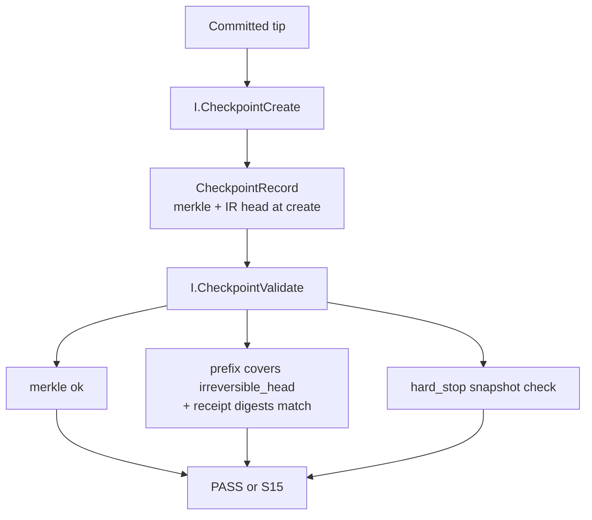
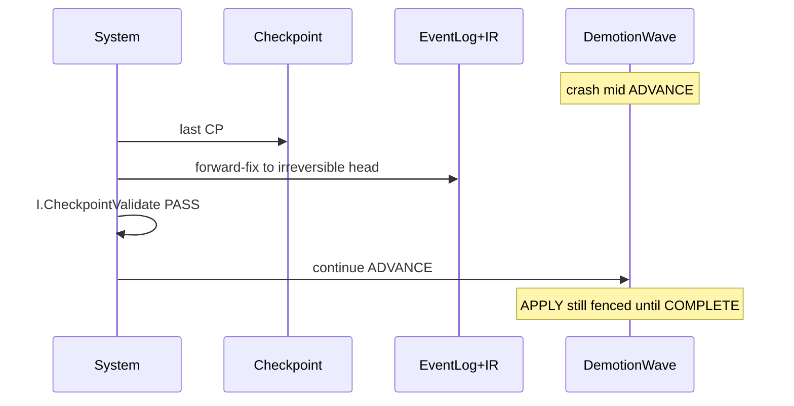
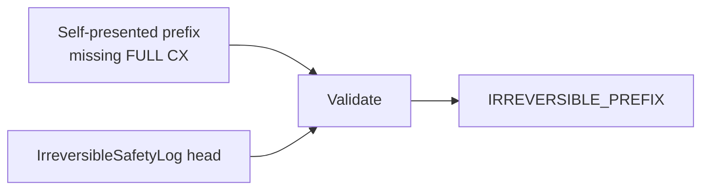

# 13 — Failure recovery & checkpoint

**Normative:** `ART-16b` demotion · `ART-17b` checkpoint/restore  
**Appendix:** ART-16 / ART-17 prose

## Plain English

Demotion is crash-resumable. Restore cannot accept a fake short history that drops irreversible events. Hard-stop after restore still comes from ControlState.

---

## Checkpoint create / validate

---

## Mid-wave crash resume

---

## Truncation attack blocked

