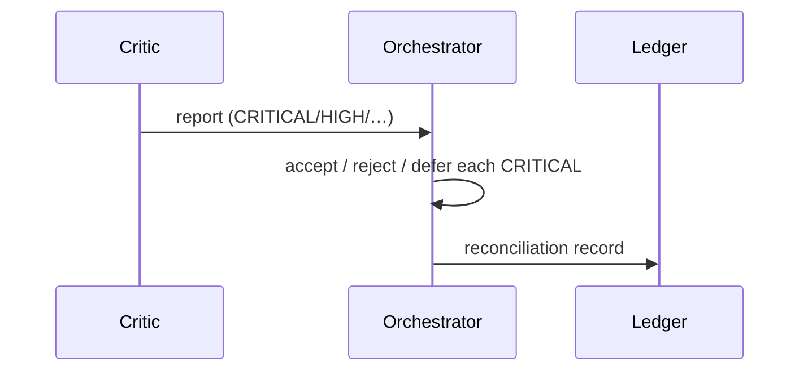
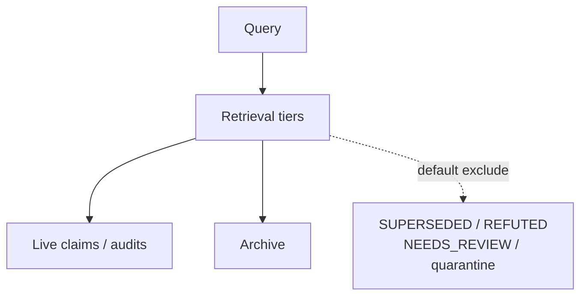

# 14 — Model protocols & memory

**Partial / migrating:** `ART-18` model protocols · `ART-18b` linter · `ART-19` memory

## Plain English

Critics produce reports; orchestrator reconciles. Credit requires act-time principal/binding/model pins (`I-MP-02`). Memory retrieval must not quietly serve SUPERSEDED/REFUTED evidence into promotion.

---

## Critic loop (design-time)

Unpinned or mismatched author fields ⇒ **not a credited act**.

---

## Memory tiers

Promotion evidence must still pass ART-11c `I-EV-01` on `basis_digests`.
