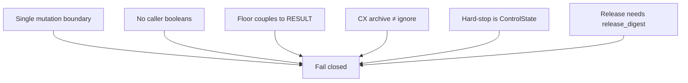
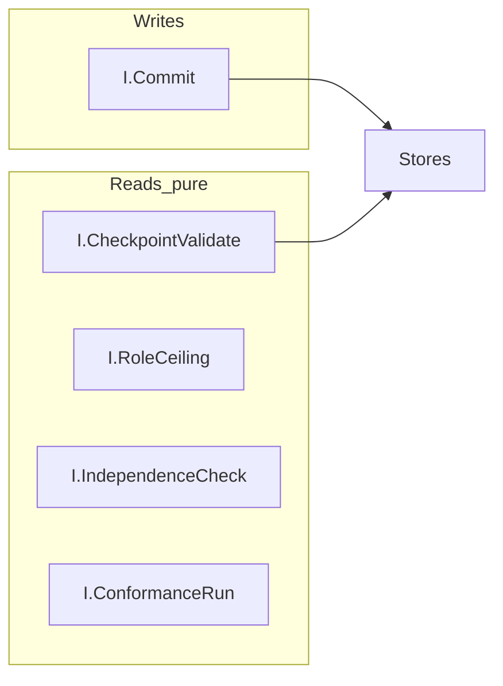
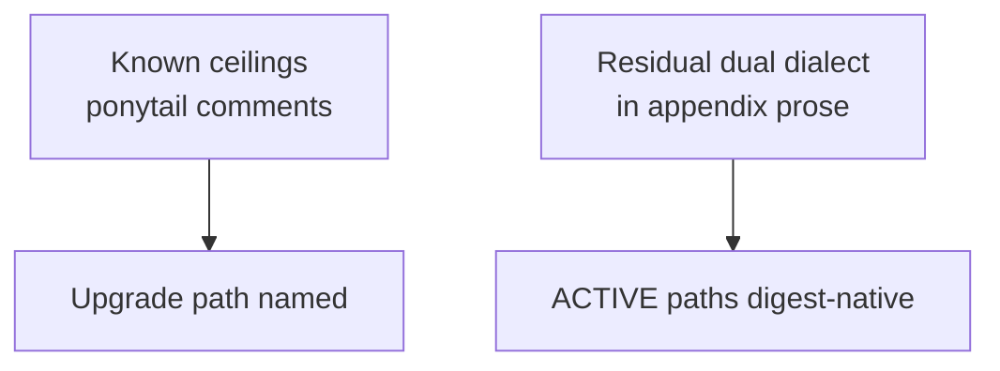

# 15 — Invariants & interfaces

**Partial:** `ART-20` invariants · `ART-20b` convergence · `ART-24` interfaces · `ART-23` limitations

## Plain English

Hard invariants are the “never break these” list. Interfaces name the public entrypoints (`I.Commit`, `I.CheckpointValidate`, …). Convergence credit is **reset** for repair — do not cite old C12=2.

---

## Core invariants (mental model)

---

## Interface map

---

## Limitations posture

