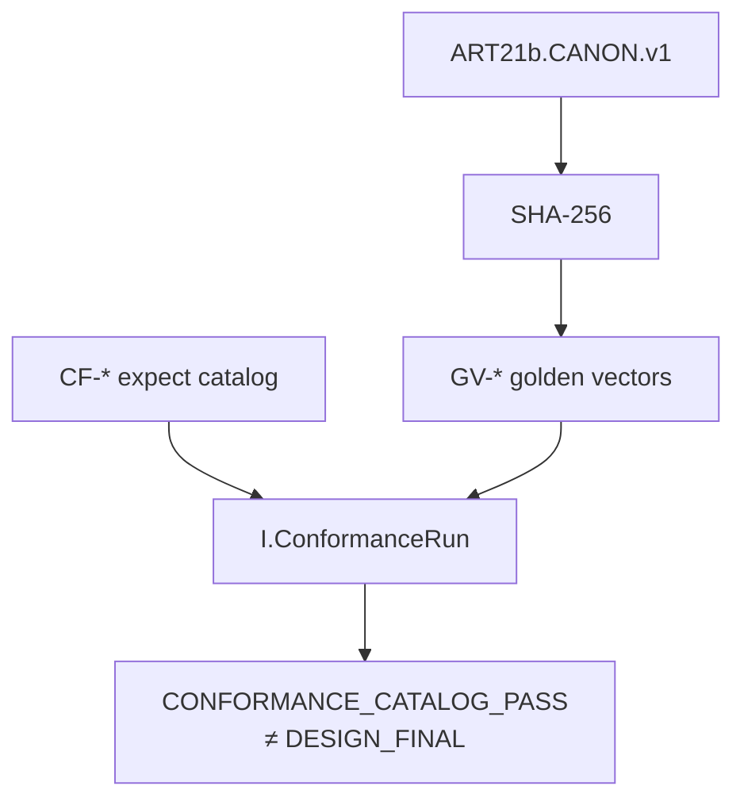
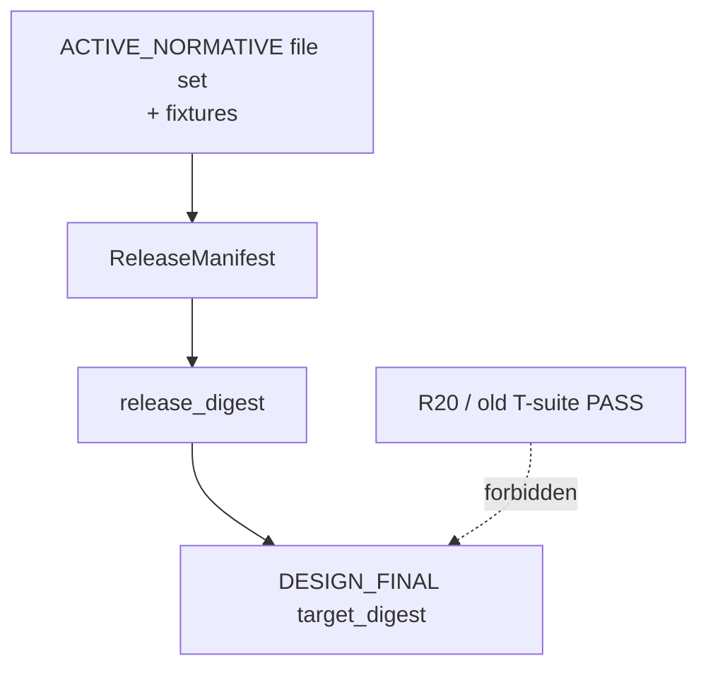
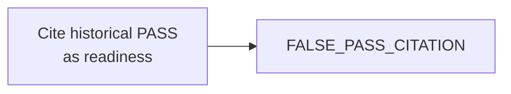

# 16 — Conformance & release identity

**Normative:** `ART-21b` conformance · `ART-25b` release identity  
**Historical:** ART-21 T-suite (do not cite as clearance)

## Plain English

Digests are SHA-256 over canonical JSON. Fixtures lock golden digests. A **ReleaseManifest** is the only thing a future `DESIGN_FINAL` may point at.

---

## Conformance

---

## Release seal

---

## False-pass ban

