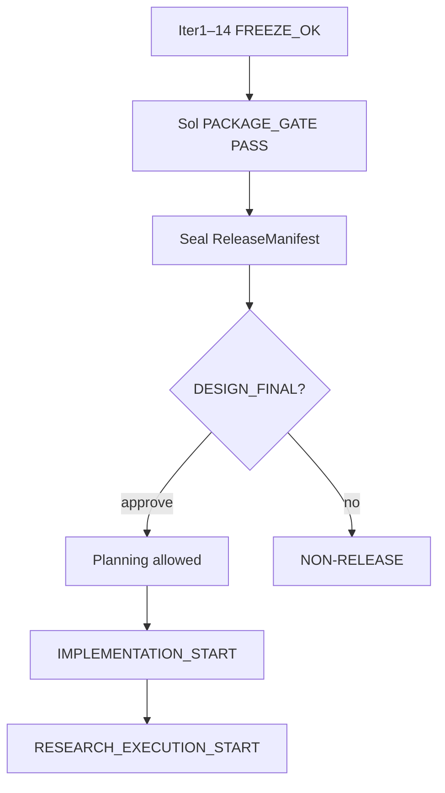
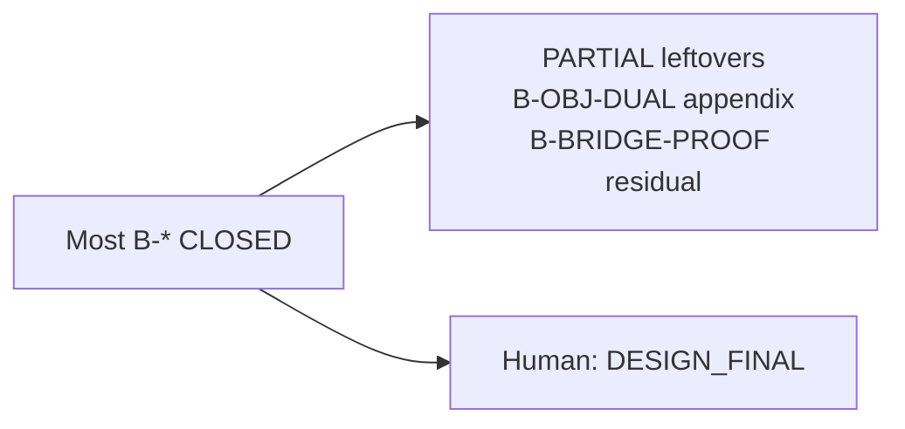

# 17 — Repair posture & gates

**Control plane:** `architecture/00-repair/` · `ART-25` · `IMPLEMENTATION_BLOCK.md` · Sol evidence under `adversarial_review_artifacts/`

## Plain English

The package finished Iter1–14 repair and a **Sol package gate PASS**. That does **not** lift implementation. You still own `DESIGN_FINAL`.

---

## Current status

---

## Blocker ledger shape

---

## Where to look

| Need | Path |
|------|------|
| Status pins | `architecture/25-audit-reports/FINAL_AUDIT.md` |
| Blockers | `architecture/00-repair/BLOCKER_LEDGER.md` |
| Sol PASS note | `architecture/adversarial_review_artifacts/REPAIR_PACKAGE_SOL_GATE_PASS_2026-07-24.md` |
| Visual overview | [00-GENERAL.md](00-GENERAL.md) |
