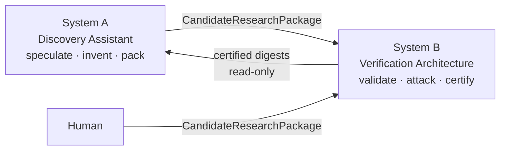
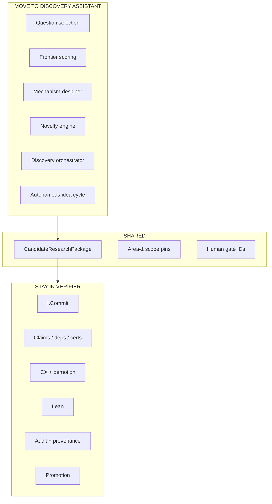
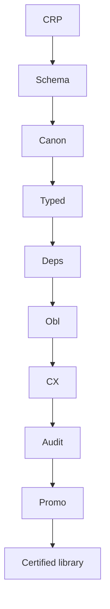
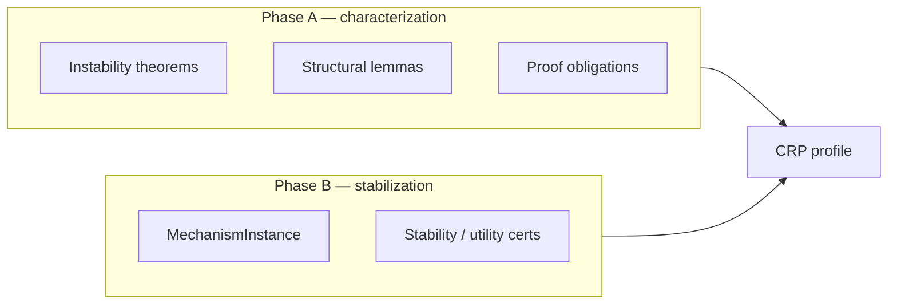

# 18 — Dual-system separation (visual)

Companion to [`../architecture/00-repair/DUAL_SYSTEM_SEPARATION_PLAN.md`](../architecture/00-repair/DUAL_SYSTEM_SEPARATION_PLAN.md).

## Two systems

## What moves where

## Intake pipeline

## Phase A vs Phase B packages

Mechanism is **optional** on Phase A.

## Ownership after M4

- Discovery FSM / frontier / cards → `../architecture-discovery/`
- Verification Commit / cycle bind / CRP intake → `../architecture/`
- Visuals remain explanatory only
