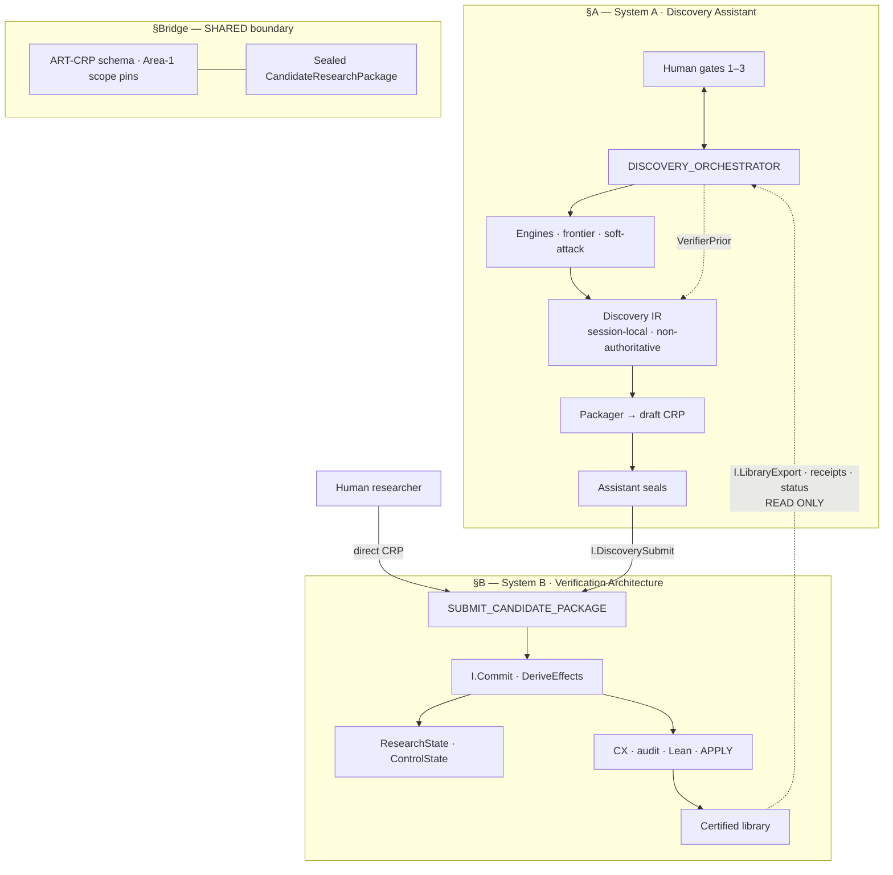
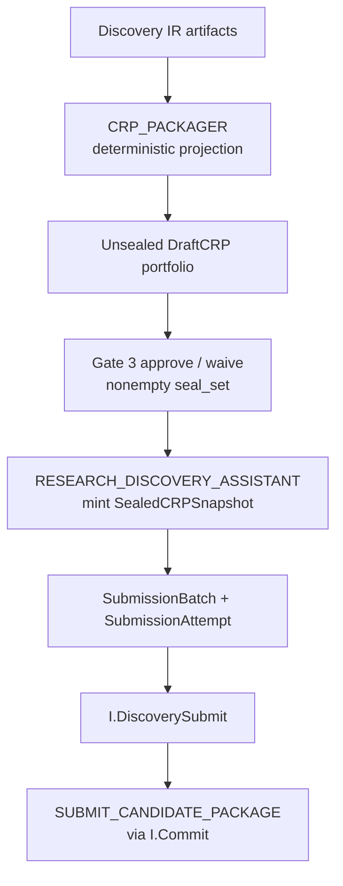
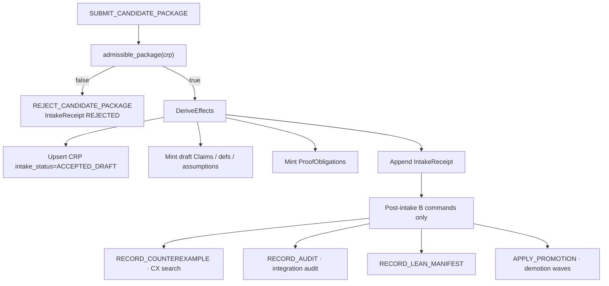
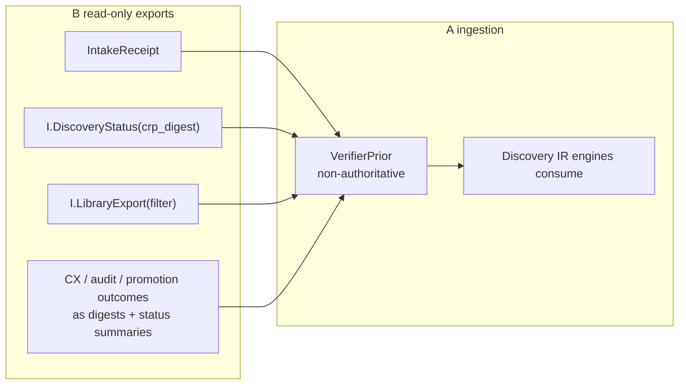
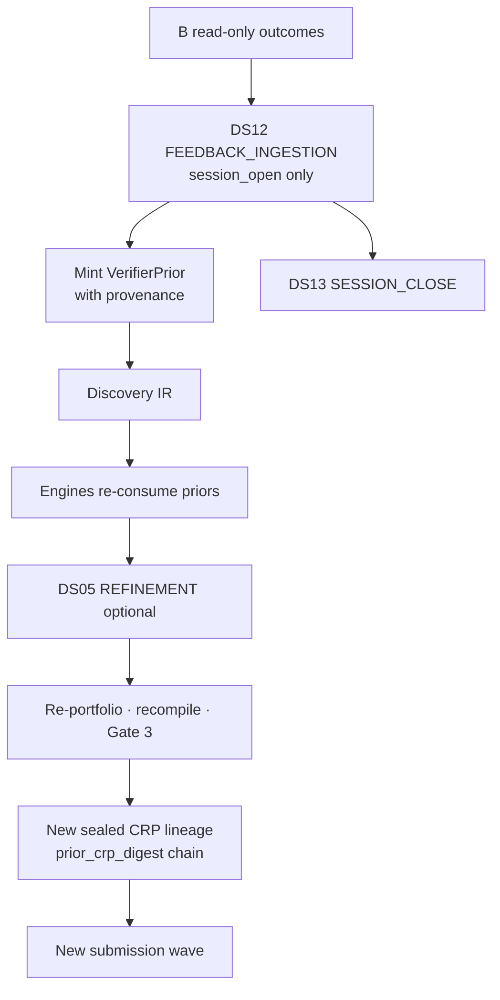
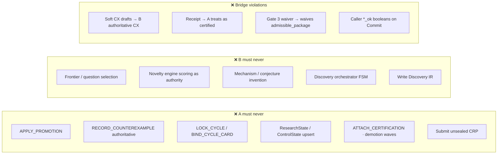

# Discovery ↔ Verifier Information Flow (System A ↔ System B)

**Companion to:** [18-dual-system-separation.md](18-dual-system-separation.md) · [DUAL_SYSTEM_SEPARATION_PLAN](../architecture_verifier/00-repair/DUAL_SYSTEM_SEPARATION_PLAN.md)  
**Normative sources:** ART-INT-00 · ART-CRP · ART-A-06 · ART-A-03 · ART-06b · ART-01D · ART-01V  
**Package:** `ARCH-0.3-REPAIR` · **NON-RELEASE** · **DUAL.2** + **INT.1**  
**Canvas:** [`discovery-verifier-bridge.canvas.tsx`](../../.cursor/projects/Users-nicholasmino-Desktop-Research-Work/canvases/discovery-verifier-bridge.canvas.tsx)

> **Canonical interface authority:** [`architecture-integration/00-A-B-INTEGRATION.md`](../architecture-integration/00-A-B-INTEGRATION.md) (ART-INT-00). This file is a **narrative companion** only.  
> **Canonical location for this narrative:** `architecture-visual/` (this file). Short pointer: [`docs/DISCOVERY_VERIFIER_INFORMATION_FLOW.md`](../docs/DISCOVERY_VERIFIER_INFORMATION_FLOW.md).

**Related guides:** [System A flow](../architecture-discovery/ARCHITECTURE_INFORMATION_FLOW.md) · [System B flow](../architecture_verifier/ARCHITECTURE_INFORMATION_FLOW.md) · canvas `discovery-verifier-bridge.canvas.tsx`

---

## Big picture — dual-system labeled sections

| ID | Section | Job | Store owner |
|----|---------|-----|-------------|
| **A** | Discovery Assistant | Invent, schedule, pack, seal; session FSM | A-side: Discovery IR, session logs |
| **Bridge** | CRP boundary | Sole mathematical crossing; equal authors (Human \| Assistant) | B-side: CRP row + IntakeReceipt after accept |
| **B** | Verification Architecture | Canonicalize, validate, attack, audit, promote, certify | B-side: ResearchState, ControlState, library |
| **↩** | Read-only return | Receipts, status, certified digests → `VerifierPrior` | A-side IR only; never B authority |

### Big picture IO

| | |
|--|--|
| **IN** | Human scope/gates; read-only B library exports; literature (A-side) |
| **OUT** | Sealed CRP (A→B); certified digests + receipts (B→A read path) |
| **WHO** | A: Orchestrator + engines + Assistant author; B: `VERIFICATION_ORCHESTRATOR` / `HUMAN_GATE_OPERATOR` on intake; Human may submit CRP directly to B |
| **STORE** | A: Discovery IR, SessionEvent, SubmissionBatch; B: ResearchState, ControlState, EventLog, certified library |

---

## §1 — What System A sends (A → Bridge → B)

### §1 IO

| | |
|--|--|
| **IN** | Gate-3-authorized `DraftCRP.version_id` set; compiled IR (definitions, claims, sketches, optional mechanisms per profile) |
| **OUT** | `CandidateResearchPackage` bytes (`crp_digest`); one logical submission per sealed digest; idempotency key = sealed digest |
| **WHO** | `CRP_PACKAGER` compiles; `RESEARCH_DISCOVERY_ASSISTANT` seals; `DISCOVERY_ORCHESTRATOR` owns batch; submit alias `I.DiscoverySubmit` → B Commit |
| **STORE (A)** | `DraftCRP`, `SealedCRPSnapshot`, `SubmissionBatch`, `SubmissionAttempt`, `SessionEvent` |
| **STORE (B)** | On accept only: live `CandidateResearchPackage`, `IntakeReceipt`, draft Claims/ProofObligations (via DeriveEffects) |

**Profiles (payload rules):**

| Profile | Mechanism required? | Typical claim families |
|---------|---------------------|------------------------|
| `PHASE_A_CHARACTERIZATION` | No | characterization, instability, obligations |
| `PHASE_B_STABILIZATION` | Yes | stability / utility / inference chain |
| `MIXED` | Per-claim | characterization + stabilization segments |
| `OBLIGATION_ONLY` / `BRIDGE_ONLY` | Per ART-CRP I-CRP-02/07 | obligations or bridge-facing claims |

**Packager purity:** projection introduces **no** new math — only maps IR → CRP payload fields (ART-A-06 M-A06-PROJ).

---

## §2 — What System B does on intake (Bridge → B)

### §2 IO

| | |
|--|--|
| **IN** | Sealed `CandidateResearchPackage`; `caller_principal_digest` (`VERIFICATION_ORCHESTRATOR` or `HUMAN_GATE_OPERATOR`); `expected_state_head_digest` |
| **OUT** | `IntakeReceipt` (`ACCEPTED_DRAFT` or `REJECTED`); `draft_claim_digests[]`; `obligation_digests[]`; reason codes on reject |
| **WHO** | B `I.Commit` sole mutator; intake auth = `VERIFICATION_ORCHESTRATOR` \| `HUMAN_GATE_OPERATOR`; A never calls Commit directly on ResearchState |
| **STORE (A)** | `SubmissionAttempt.b_intake_result`, `receipt_ref` (read copy for session) |
| **STORE (B)** | `CandidateResearchPackage`, `IntakeReceipt`, draft Claims/Assumptions/Defs, `ProofObligation`s, EventLog `MutationEvent` |

**Admissibility checks (`admissible_package`):**

1. `math_scope_pin_digest` matches live Area-1 pin  
2. Author auth: `HUMAN` ACTIVE, or `RESEARCH_DISCOVERY_ASSISTANT` with live RoleBinding  
3. Profile rules (I-CRP-02/05/07)  
4. Valid `chain_segment` enum (incl. `characterization`)  
5. No SIMULATION-only loop writing ResearchState  

**Human direct path:** Human researcher assembles/seals CRP → same `SUBMIT_CANDIDATE_PACKAGE` — B treats bytes identically (TRACE-CRP-D).

**Optional cycle path (I-CRP-31):** `LOCK_CYCLE` only if using ART-08d cycle commands; caller = `VERIFICATION_ORCHESTRATOR` only — **not** A `FRONTIER_SCHEDULER`.

---

## §3 — What System B returns (B → Bridge → A read path)

### §3 IO

| | |
|--|--|
| **IN** | `crp_digest`, `receipt_digest`, sealed snapshot ref; library filter (certified artifacts only) |
| **OUT** | Intake status (`ACCEPTED_DRAFT` \| `REJECTED`); draft/live/superseded summaries; certified artifact digests; obligation/CX/audit outcome digests — **never** live ResearchState mutation handles |
| **WHO** | B serves read APIs; `DISCOVERY_ORCHESTRATOR` mints `VerifierPrior` on DS12 (open session only) |
| **STORE (A)** | `VerifierPrior` in Discovery IR — must cite `sealed_digest` and/or `receipt_ref` + `source_session_id` |
| **STORE (B)** | Authoritative rows remain in ResearchState / library; exports are derived views |

**Never returned as A authority:** promotion maturity, authoritative `Counterexample`, `ControlState`, `HardStopRecord`, Lean certification status as if A-certified.

---

## §4 — What System A may do with feedback (A-side only)

### §4 IO

| | |
|--|--|
| **IN** | `IntakeReceipt`, `I.DiscoveryStatus`, `I.LibraryExport` digests; human-authorized import |
| **OUT** | Revised IR; optional new draft/sealed CRP (new digest); new `SubmissionBatch` — never retroactive seal mutation |
| **WHO** | `DISCOVERY_ORCHESTRATOR` controls DS12; engines consume `VerifierPrior`; Assistant seals **new** packages only |
| **STORE (A)** | `VerifierPrior`, revised IR artifacts, new batch/attempt lineage |
| **STORE (B)** | Unchanged by A feedback ingestion — A does not write B |

**Late feedback (I-A03-12):**

- Open session: DS12 may mint active `VerifierPrior` with `sealed_digest` / `receipt_ref` provenance  
- After DS13: session never reopens; late feedback seeds **new** session via authorized import  
- Archival receipt links on closed session: no math effect  

**Optional same-session continue:** DS12 → DS05 → full re-portfolio / compile / Gate 3 before another submit.

**Retry rules (ART-A-06 M-A06-BATCH):** reuse idempotency key; do **not** resubmit members already `ACCEPTED_DRAFT`; transport failure ≠ B rejection.

---

## §5 — Illegal crossings (forbidden flows)

### §5 IO (what is forbidden)

| Crossing | Why illegal | Correct path |
|----------|-------------|--------------|
| A → `APPLY_PROMOTION` | Only B raises maturity | Resubmit revised CRP; B APPLY after gates |
| A → `LOCK_CYCLE` | A frontier ≠ B cycle lock | B `VERIFICATION_ORCHESTRATOR` post-intake only |
| A → ResearchState write | I-MUT-01 sole mutator = `I.Commit` from B roles | `I.DiscoverySubmit` → `SUBMIT_CANDIDATE_PACKAGE` only |
| A → authoritative CX | CX mint is B DeriveEffects | Soft-attack drafts in CRP payload; B `RECORD_COUNTEREXAMPLE` |
| A → ControlState / Lean certify | B governance + proof floor | Read library exports as priors |
| A submits unsealed CRP | I-A06-04 sealed-only | Gate 3 → seal → submit |
| Soft CX → B CX without Commit | Non-authoritative until B accepts | CX drafts in CRP; B evaluates |
| Receipt → A certification | Receipt = intake accept, not promote | `VerifierPrior` labeled non-authoritative |
| Gate 3 waiver → B admissibility | Waivers are A-session scoped | B `admissible_package` always enforced |
| B → frontier / novelty authority | B non-goals (ART-01V) | A `FRONTIER_SCHEDULER` on IR only |
| B → invent mechanisms/conjectures | Discovery engines are A | CRP payload from A or Human |
| Human CRP bypass schema | Same intake rules | `SUBMIT_CANDIDATE_PACKAGE` + admissibility |
| Caller `*_ok` on Command | I-BOOL-01 ban | Derived predicates in `validation_preimage` only |

---

## Legal vs illegal crossings (summary)

1. **Legal A→B (sole math mutation):** sealed `CandidateResearchPackage` → `I.DiscoverySubmit` → `SUBMIT_CANDIDATE_PACKAGE` → B `I.Commit` DeriveEffects.  
2. **Legal B→A (read only):** `IntakeReceipt`, `I.DiscoveryStatus`, `I.LibraryExport` / certified digests → A `VerifierPrior` in open-session IR — never promotion authority.  
3. **Legal Human→B:** direct sealed CRP via same intake command — equal to Assistant-authored packages.  
4. **Illegal A:** `LOCK_CYCLE`, `APPLY_PROMOTION`, demote, authoritative CX, ControlState writes, Lean certify, unsealed submit, ResearchState upsert.  
5. **Illegal B:** frontier scoring, novelty engine as authority, mechanism/conjecture invention, discovery FSM, writing Discovery IR.  
6. **Illegal bridge:** treating soft-attack drafts or intake receipts as B-certified truth; Gate 3 waivers substituting for `admissible_package`; caller `*_ok` authorization fields.

---

## Quick reference — APIs at the boundary

| API | Direction | Mutates B? | A use |
|-----|-----------|------------|-------|
| `I.DiscoverySubmit(crp)` | A→B | Yes (via Commit) | Sole A write alias |
| `SUBMIT_CANDIDATE_PACKAGE` | →B | Yes | Normative Commit command |
| `REJECT_CANDIDATE_PACKAGE` | B internal | Yes | B orchestrator on failed intake |
| `I.DiscoveryStatus(crp_digest)` | B→A | No | Poll intake / draft status |
| `I.LibraryExport(filter)` | B→A | No | Certified digests for priors |
| `APPLY_PROMOTION` | B internal | Yes | **A forbidden** |
| `RECORD_COUNTEREXAMPLE` | B internal | Yes | **A forbidden** (authoritative) |
| `LOCK_CYCLE` | B internal | Yes | **A forbidden** (`FRONTIER_SCHEDULER`) |

---

## Related documents

| System | Document |
|--------|----------|
| A overall | [`architecture-discovery/00-OVERALL.md`](../architecture-discovery/00-OVERALL.md) |
| A session / submit | [`architecture-discovery/03-SESSION-LIFECYCLE.md`](../architecture-discovery/03-SESSION-LIFECYCLE.md) |
| A CRP interface | [`architecture-discovery/06-CRP-INTERFACE.md`](../architecture-discovery/06-CRP-INTERFACE.md) |
| B CRP normative | [`architecture_verifier/24-interfaces/CANDIDATE_RESEARCH_PACKAGE.md`](../architecture_verifier/24-interfaces/CANDIDATE_RESEARCH_PACKAGE.md) |
| B mutation | [`architecture_verifier/06-state/MUTATION_AND_AUTHORITATIVE_STATE.md`](../architecture_verifier/06-state/MUTATION_AND_AUTHORITATIVE_STATE.md) |
| Dual plan | [`architecture_verifier/00-repair/DUAL_SYSTEM_SEPARATION_PLAN.md`](../architecture_verifier/00-repair/DUAL_SYSTEM_SEPARATION_PLAN.md) |
| Visual dual | [18-dual-system-separation.md](18-dual-system-separation.md) |
