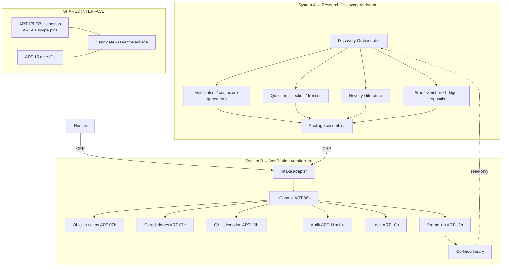
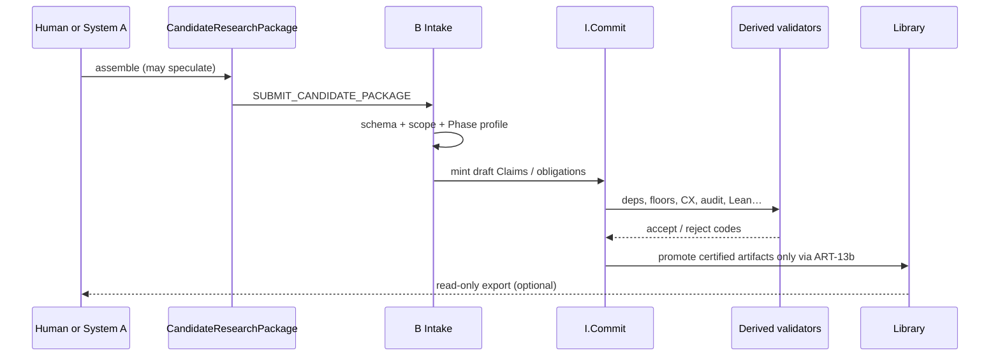
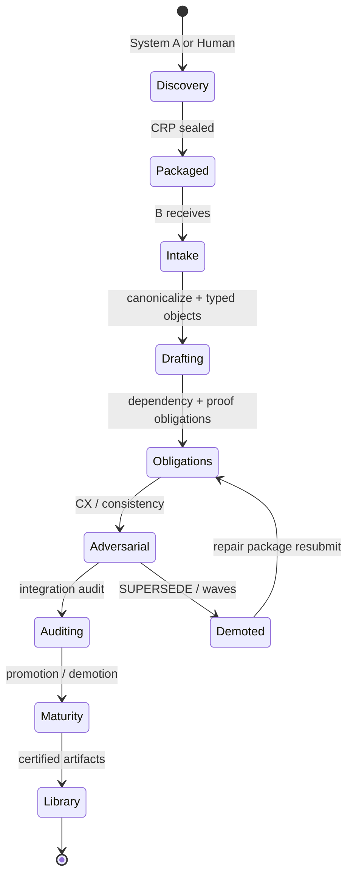
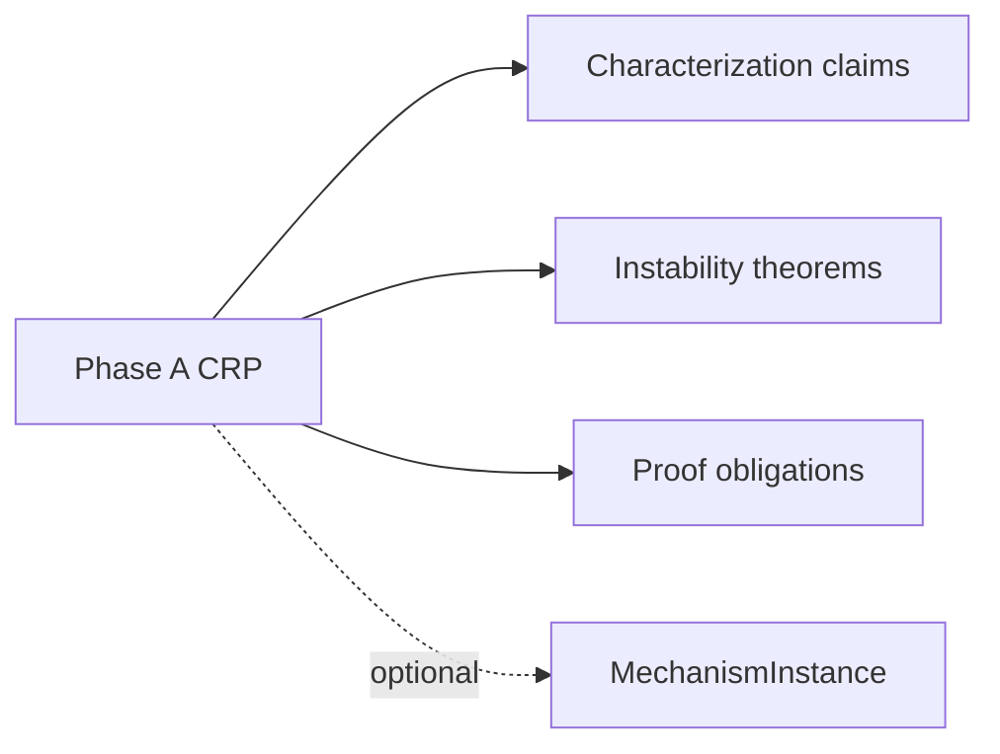
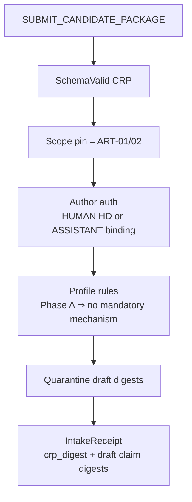
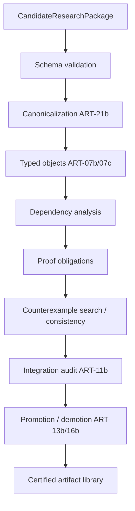

# Dual-System Separation Plan

**Document ID:** `PLAN-DUAL-SYSTEM-01`  
**Status:** Design-plane M1–M6 **executed** · DUAL.2 targeted repair **executed** · M7 human gates pending  
**Date:** 2026-07-24  
**Premise:** Prior audit = **APPROVE WITH REQUIRED CHANGES** — verification backbone is sound; required changes are **separation**, not redesign.  
**Package:** `ARCH-0.3-REPAIR` · **NON-RELEASE**  
**Execution posture:** Design-plane refactor **authorized** (architecture docs only). Software implementation / research execution remain blocked by `IMPLEMENTATION_BLOCK` until human gates.

**Principle:** Do **not** redesign Commit, Claim graph, assumptions, CX, Lean, promotion/demotion, certificates, dependency graphs, object system, governance, or audit. Extract autonomous discovery into System A. System B consumes only **Candidate Research Packages**.

---

## 0.1 Plan audit findings (fixed)

| ID | Issue | Fix |
|----|-------|-----|
| P1 | Header forbade all execution, blocking design refactor | Authorize **architecture** edits; keep code/research blocked |
| P2 | `admissible_experiment` still assumes S02 + perturbation-shaped `chain_link` | CRP-based `admissible_package(crp)` + Phase A `chain_link` values incl. `characterization` |
| P3 | Frontier Scheduler → A but B `LOCK_CYCLE` still requires `FRONTIER_SCHEDULER` | B post-intake lock uses `VERIFICATION_ORCHESTRATOR` (or intake role); A frontier never calls B `LOCK_CYCLE` |
| P4 | Invented `RESEARCH_ORCHESTRATOR_VERIFIER` not in ART-04c | Use `VERIFICATION_ORCHESTRATOR` + `SUBMIT_CANDIDATE_PACKAGE` auth |
| P5 | Dual APIs `I.DiscoverySubmit` vs `SUBMIT_CANDIDATE_PACKAGE` | Single write path: Commit command; `I.DiscoverySubmit` = thin A-side alias that only builds that Command |
| P6 | Physical move of ART-08b before CRP exists | M2 CRP first; M4 = ownership relocate to `architecture-discovery/` + ASI tags (content preserved) |
| P7 | Charter Area-1 invariant “every milestone on perturbation→…” conflicts with Phase A | Split: Phase A milestones may end at characterization/instability; full chain required for Phase B / MIXED stabilization claims |

---

## 0. Target ecosystem (one paragraph)

Two cooperating systems: **A — Research Discovery Assistant** invents and packages research; **B — Verification Architecture** canonicalizes, validates, attacks, audits, and promotes. They share schemas and human gates but **not** mutation authority. A never writes ResearchState. B never chooses the next research question.


---

## 1. Subsystem classification (every major piece)

Legend: **A** = Discovery Assistant · **B** = Verifier · **SHARED** = interface / constitution both honor

| Subsystem / Artifact | Class | Move / ownership |
|----------------------|-------|------------------|
| ART-01 Charter (rechartered) | SHARED | Recharter B as verification-only; A gets its own discovery charter citing same Area-1 math scope |
| ART-02 Math scope pins | SHARED | Read-only both; B enforces at intake |
| ART-03 System context | SHARED | Rewrite as A ↔ CRP ↔ B |
| ART-04 role labels | A+B | Split rosters |
| ART-04c Identity / HumanDecision | B | Trust root for verification Commits; A may use advisory principals |
| ART-04d Operable minimal / RoleCeiling | B | Enforce on B Commits; export which roles A may *claim as author of CRP* |
| ART-05 Authority matrix | B | Post-intake governance |
| ART-06b I.Commit / stores / hard-stop | B | **Untouched kernel** — A never calls Commit on ResearchState |
| ART-07b Canonical objects | SHARED schemas / B mutation | Object identities shared; only B mutates live rows |
| ART-07c Certs / bridges | B | A may propose drafts inside CRP; B types & evaluates |
| ART-08 Research-cycle FSM (S00–S08 discovery) | A | Extract discovery phases to A |
| ART-08b Question selection / frontier / novelty dampener | A | **Move whole** — core of A |
| ART-08c Experiment cards (authoring) | A → SHARED payload | Author in A; frozen cards travel in CRP |
| ART-08d Cycle binding (Commit persistence) | B | Keep bind/Commit; post-intake verification cycles only; lock role = VERIFICATION_ORCHESTRATOR (not A frontier) |
| ART-09 Theorem FSM (legacy) | B legacy | Stay superseded by 13b |
| ART-10b Lean binding | B | **Keep** |
| ART-11b Audit binding | B | **Keep** |
| ART-11c Provenance / DD | B | **Keep**; A declares `reads[]` in CRP |
| ART-12 CX protocol (search tactics) | A propose / B commit | Attack *search* can run in A or as B service; `RECORD_COUNTEREXAMPLE` stays B |
| ART-13b PromotionIntent / APPLY | B | **Keep** — sole maturity raise |
| ART-14 Literature / novelty ladder | A (work) / B (gates) | A does lit search; B enforces novelty gates at APPLY |
| ART-15 Human gates | SHARED | Both may request; only B Commit records HD |
| ART-16b Demotion waves | B | **Keep** |
| ART-17b Checkpoint / IR log | B | **Keep** |
| ART-18 Model protocols / critics | A (research memos) | Design critics stay meta; research critique feeds A, not B state |
| ART-18b Bullshit linter | A | Pre-intake filter; B may re-check read-only |
| ART-19 Memory / retrieval | A retrieve / B filter | A uses frontier memory; B filters evidence tiers at APPLY |
| ART-20 Invariants | B | **Keep** on verification path |
| ART-20b Design convergence | SHARED | Split C-predicates per system |
| ART-21b Conformance | B | Add CRP intake fixtures |
| ART-22 E2E traces | SHARED | Rewrite as A→CRP→B traces |
| ART-23 Limitations | SHARED | Partition A vs B risks |
| ART-24 Interfaces | SHARED | **Home of CRP intake API**; `I.Commit` remains B-only |
| ART-25 / 25b Audit & release | B | Verification package identity |
| Mechanism Designer / conjecture generators | A | **Extract** — never inside B runtime |
| Research Orchestrator (discovery loop) | A | **Extract** — B has verification orchestrator only (apply/audit/CX services) |
| Frontier Scheduler (S02 choose-next) | A | **Extract** |
| Autonomous research cycle (idea→conjecture) | A | **Extract** |
| CandidateResearchPackage (new) | SHARED | **New** sole external mathematical intake |
| Phase-A characterization packages | SHARED→B | First-class CRP profiles; MechanismInstance **optional** |

### Moves explained (short)

1. **Anything that chooses or invents research** → A (question selection, frontier scoring, novelty engine, mechanism/conjecture proposal, autonomous cycle S00–S08).  
2. **Anything that decides truth / maturity / durability** → B (Commit, floor, CX mint, demotion, audit, Lean, APPLY, release).  
3. **Schemas both must agree on** → SHARED (charter Area-1, digests, CRP schema, human gate IDs).  
4. **Do not delete A machinery** — relocate ownership and cut B’s dependency edges so B only sees CRP.

---

## 2. Updated architecture diagram



---

## 3. Updated information flow



**Forbidden flows (cut):**

- A → `APPLY_PROMOTION` / `RECORD_COUNTEREXAMPLE` / ResearchState upsert  
- B → frontier score / “pick next conjecture” / Mechanism Designer internals  
- Caller `*_ok` booleans (unchanged ban in B)

---

## 4. Updated control flow



Control planes:

| Concern | Owner |
|---------|--------|
| What to research next | A or Human |
| Whether a claim is live / certified | B only |
| Hard-stop / release / DESIGN_FINAL | Human via B Commit |
| Discovery session crash | A-local (re-submit CRP) |
| Verification state crash | B ART-17b |

---

## 5. Updated object model

### 5.1 Keep in B (no redesign)

Claim, DefPin, Assumption, Discharge, MechanismInstance (**optional**), Counterexample, DemotionWave, AuditRecord, LeanManifest, PromotionIntent, CertificationRecord, Bridge/Utility objects, ControlState, IrreversibleSafetyLog, EventLog.

### 5.2 New SHARED: `CandidateResearchPackage`

```text
CandidateResearchPackage
  crp_digest = H("CRP.v1", author_kind, author_binding_digest, profile,
                 payload_canonical, prior_crp_digest_or_⊥)
  author_kind              # HUMAN | RESEARCH_DISCOVERY_ASSISTANT
  author_principal_digest
  author_binding_digest?   # required for ASSISTANT
  profile                  # PHASE_A_CHARACTERIZATION | PHASE_B_STABILIZATION | MIXED | OBLIGATION_ONLY
  math_scope_pin_digest    # ART-02 / Area-1 pin
  payload:
    definitions[]          # draft DefinitionVersion bodies
    assumptions[]
    claims[]               # theorem/lemma/conjecture candidates
    proof_sketches[]       # non-authoritative until B attaches ProofEvidence
    bridge_proposals[]
    mechanism_proposals[]  # OPTIONAL — absent OK for Phase A
    examples[] / falsifiers[]
    counterexample_claims[]
    certificate_drafts[]
    literature_refs[]
    declared_reads[]       # for ART-11c DD
    free_text_notes?       # explanatory only
  sealed_at
```

**I-CRP-01:** Sole external mathematical intake object for B.  
**I-CRP-02:** `profile=PHASE_A_CHARACTERIZATION` ⇒ MechanismInstance **not required**.  
**I-CRP-03:** Stabilization mechanisms never implied by presence of optimization primitives alone.  
**I-CRP-04:** Speculative fields never become ResearchState authority until B Commit DeriveEffects succeed.

### 5.3 Phase A first-class (no forced perturbation ontology)

Allowed Phase A claim families (examples, not closed enum):

- operator / selection characterization  
- instability theorems (argmax, top-k, sorting sensitivity, LP basis, matching discontinuity, …)  
- structural lemmas / composition theorems  
- proof obligations only  



---

## 6. Updated package intake model



**Commands (B):**

- `SUBMIT_CANDIDATE_PACKAGE` — `VERIFICATION_ORCHESTRATOR` or `HUMAN_GATE_OPERATOR` (human-authored CRP); payload = CRP  
- `REJECT_CANDIDATE_PACKAGE` — same auth; typed reason codes  
- `LOCK_CYCLE` (ART-08d) — **post-intake only**; caller role `VERIFICATION_ORCHESTRATOR` (A frontier does not lock B cycles)  
- Existing B commands unchanged thereafter (`RECORD_COUNTEREXAMPLE`, `APPLY_PROMOTION`, …)  

**A-side alias:** `I.DiscoverySubmit(crp)` MAY exist as a client helper that only submits `SUBMIT_CANDIDATE_PACKAGE` via an authenticated B Committer — it is not a second mutation boundary.

**Authors:**

| author_kind | Requirement |
|-------------|-------------|
| HUMAN | ART-04c HumanDecision or authenticated HUMAN principal per policy |
| RESEARCH_DISCOVERY_ASSISTANT | live RoleBinding `role_id=RESEARCH_DISCOVERY_ASSISTANT` + model_prov if MODEL_RUNTIME |

B treats both identically after intake: **only the CRP bytes matter**.

---

## 7. Updated verification pipeline



Each stage remains the **existing** B machinery; intake is the only new front door.

| Stage | Existing owner |
|-------|----------------|
| Schema / canon | ART-07b + ART-21b |
| Typed objects / bridges | ART-07b/07c |
| Dependencies / assumptions | ART-07b |
| CX / demotion | ART-07b I-CX + ART-16b |
| Audit / provenance | ART-11b/11c |
| Lean | ART-10b |
| Promotion | ART-13b |
| Durability | ART-17b |

---

## 8. Updated Discovery Assistant interface

System A is a **separate product/profile**. It may keep all creative engines.

### 8.1 A responsibilities

- invent conjectures / mechanisms / bridges / experiments  
- literature search & novelty scoring  
- frontier / question selection  
- autonomous discovery cycles  
- assemble and seal CRPs  
- optional local “soft” CX search (non-authoritative)

### 8.2 A → B API (only)

```text
I.DiscoverySubmit(crp) -> IntakeReceipt | Reject
I.DiscoveryStatus(crp_digest) -> draft/live/superseded summary (read-only)
I.LibraryExport(filter) -> certified digests (read-only)
```

No other B write APIs are exposed to A.

### 8.3 What A must **not** call

`APPLY_PROMOTION`, `ATTACH_CERTIFICATION`, `RECORD_COUNTEREXAMPLE` (authoritative), `START_DEMOTION_WAVE`, `HARD_STOP_*`, direct ResearchState upserts.

### 8.4 Discovery roster (A)

Mechanism Designer, Question Selection, Frontier Scheduler, Discovery Orchestrator, Novelty Engine, Literature Analyst (discovery), Conjecture/Mechanism proposers — **all A**.

### 8.5 Verification roster (B)

Committer, Proof Certifier, Integration Auditor, EIO, Lean Verifier, Verification Orchestrator (schedules B work on submitted CRPs only), Counterexample Attacker **as B service** (optional; A may also propose CX drafts in CRP).

---

## 9. Migration plan (from current monolithic architecture)

### Phase M0 — Documentation freeze (this plan)

- Adopt classification table; no runtime change.  
- Mark discovery-owned artifacts `PENDING_EXTRACTION_TO_A` in ART-ASI.

### Phase M1 — Recharter

- Split ART-01 into:  
  - `ART-01V` Verification charter (mission = verify/certify/govern KM)  
  - `ART-01D` Discovery charter (mission = invent/propose CRPs)  
- Both cite shared Area-1 math scope pins.  
- Update ART-03 / info-flow diagrams to A↔CRP↔B.

### Phase M2 — Introduce CRP (SHARED) without deleting A logic

- Add `CandidateResearchPackage` schema (ART-07b annex or ART-24).  
- Add `SUBMIT_CANDIDATE_PACKAGE` to ART-06b/04c.  
- Adapter: existing cycle lock + cards **can be serialized into CRP** (compat shim).

### Phase M3 — Phase A profile

- Implement `PHASE_A_CHARACTERIZATION` rules (I-CRP-02).  
- Soften any remaining “MechanismInstance required at S00” gates in B intake only.  
- Keep mechanism path for Phase B / MIXED profiles.

### Phase M4 — Cut B→discovery edges

- Remove from B normative path: frontier scoring, question selection, mechanism designer hooks, novelty engine as **authoritative** inputs to Commit.  
- Relocate ART-08 / 08b / 08c **ownership** into sibling `architecture-discovery/` (move or copy+stub with pointers; preserve text).  
- ART-08d remains B; `LOCK_CYCLE` authorized for `VERIFICATION_ORCHESTRATOR` after CRP intake (not A `FRONTIER_SCHEDULER`).

### Phase M5 — Dual operable profiles

- ART-04d: B day-1 verification roster (`VERIFICATION_ORCHESTRATOR` replaces discovery orchestrator on B).  
- New ART-04e (discovery operable): A roster including `FRONTIER_SCHEDULER`, discovery orchestrator — **no** ResearchState Commit rights.  
- Shared human gates unchanged.

### Phase M6 — Conformance & release

- ART-21b fixtures: CRP Phase A intake positive/negative.  
- ART-25b: seal **verification** release; optional separate discovery profile digest.  
- E2E traces: A invents → CRP → B verifies.

### Phase M7 — Human gates

- `DESIGN_FINAL` may apply per system or to the dual-system constitution.  
- Split `RESEARCH_EXECUTION_START` → A; verification kernel implementation → B `IMPLEMENTATION_START` (policy decision for humans).

**Order constraint:** M2 before M4 (never cut discovery until CRP intake works). M3 with M2. No deletion of A engines in M4 — **move**.

---

## 10. Backwards compatibility analysis

| Area | Compat approach | Break risk |
|------|-----------------|------------|
| Existing Claims / audits / Lean / demotion state | Unchanged B objects | Low if Commit kernel untouched |
| Existing ART-08d cycles mid-flight | Shim: export cycle+cards → CRP; or grandfather `LEGACY_CYCLE_INTAKE` until closed | Medium — need one migration command |
| Call sites expecting MechanismInstance always | Phase A profile opt-out; Phase B still requires when profile says so | Medium for old automations |
| Orchestrator that both invents and APPLYs | Must split process identity; dual-role principal forbidden for invent+certify remains | High operationally, low for data |
| ART-08b inside same repo | Path move + ASI ownership; content preserved | Low |
| Historical audits citing “autonomous research system” | Revise posture language; do not revoke Sol verification PASS | Doc only |
| Human mental model | Two products; one math scope | Training |

**Non-compat (accepted):** B will **refuse** to invent next conjectures. Any workflow that relied on B’s frontier scheduler must call A (or a human) then resubmit CRP.

---

## 11. Final architecture summary

1. **Verification backbone stays** — Commit, objects, certs, CX, demotion, Lean, audit, promotion, checkpoints, conformance, release identity.  
2. **Discovery becomes System A** — all generative/scheduling creativity preserved but relocated.  
3. **CRP is the only bridge** — humans and A are equal submitters.  
4. **Phase A is first-class** — characterization/instability/obligations without mandatory mechanisms.  
5. **Separation is architectural**, not a simplification pass — no deletion of verification maturity, no deletion of discovery capability.  
6. **Next human decisions:** accept this plan; then authorize M1–M2 design edits under repair process; seal/DESIGN_FINAL remains human.

---

## Appendix A — Required charter delta (sketch)

**ART-01V purpose (B):**  
Verify, certify, govern, and manage mathematical knowledge for Area-1. Never autonomously perform mathematical discovery.

**ART-01D purpose (A):**  
Assist mathematical discovery within Area-1 by proposing Candidate Research Packages. Never mutate verification ResearchState.

## Appendix B — Visual companion

See also: `architecture-visual/18-dual-system-separation.md` (diagrams-only reading copy).

## Appendix C — Explicit non-goals of this refactor

- Redesigning hash/Commit/demotion/audit kernels  
- Removing Mechanism Designer / frontier / novelty engines  
- Collapsing Phase B stabilization ontology  
- Claiming DESIGN_FINAL or lifting IMPLEMENTATION_BLOCK

---

## Execution log (design plane)

| Phase | Status | Notes |
|-------|--------|-------|
| Plan audit P1–P7 | **done** | Fixed in §0.1 |
| M1 Recharter | **done** | ART-01 shared · ART-01V · ART-01D |
| M2 CRP | **done** | ART-CRP · SUBMIT/REJECT · ART-24 alias · ART-06b kinds |
| M3 Phase A | **done** | I-CRP-02 · `characterization` · S06 optional mechanism on A FSM |
| M4 Cut edges | **done** | `architecture-discovery/` owns 08/08b/08c; stubs in B tree; LOCK = VERIFICATION_ORCHESTRATOR |
| M5 Dual operable | **done** | ART-04d B · ART-04e A |
| M6 Conformance/docs | **done** | CF-CRP-A/B/C · ASI · ART-03 · info-flow banner · visual 18 |
| DUAL.2 targeted repair | **done** | Engines · role rename · CRP/PO registry · CHAR profiles · doc scrub |
| M7 Human gates | **pending human** | DESIGN_FINAL / split execution starts |

**Still blocked:** software implementation, research execution, sealing `release_digest`, `DESIGN_FINAL`.
