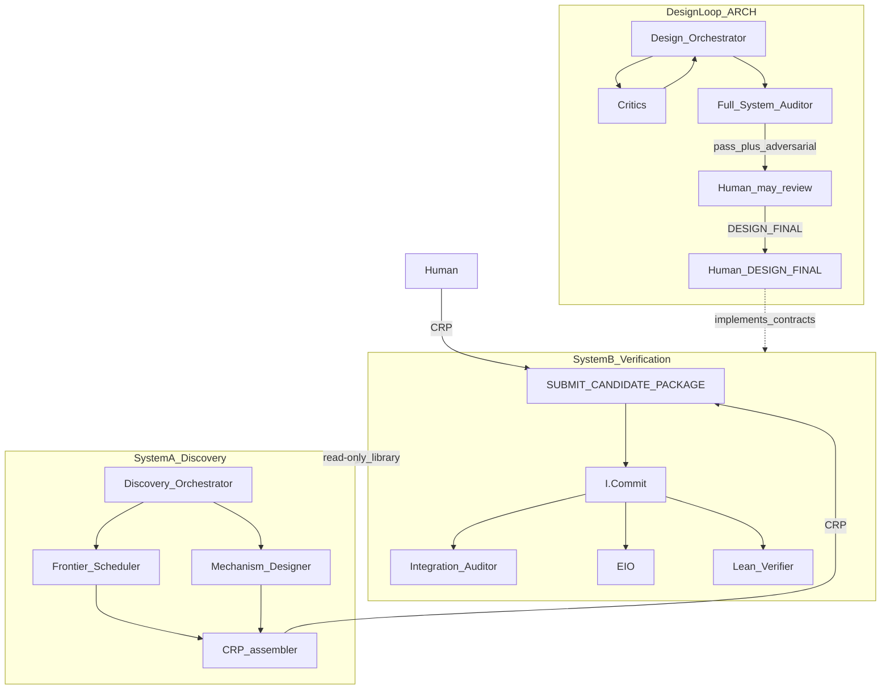

# 03 — System Context Diagram

**Artifact ID:** `ART-03`  
**Owner:** Design Orchestrator  
**Version:** `ARCH-0.3-REPAIR-DUAL.1`  
**Normative status:** `PENDING_MIGRATION`

> **DUAL.1:** Research path is **A invent → CRP → B verify**. Design loop unchanged.  
> **INCOMPATIBILITY WARNING:** Certificate-kind vocabulary is legacy (ART-07c). Role authenticity = ART-04c. Store writes: **ART-06b** `I.Commit` only. Promotion → ART-13b. Discovery never writes ResearchState.

## Purpose
Define boundaries: design-time architecture loop; discovery assistant (A); verification architecture (B) joined only by CRP.

## IO
**In:** design proposals; CRPs from human or A. **Out:** DesignState vs ResearchState writes under `loop_tag` (B only for Research).

## Authority
Design Orchestrator owns DesignState. **Verification Orchestrator** owns ResearchState after gates via Commit. Discovery Assistant authors CRP only.

## Failure modes
ResearchState writes before gate; A calling APPLY/CX mint; SIMULATION credited as research; nested invent+certify dual-role.

## Audit rules
`loop_tag` on committed events; SIMULATION excluded from `dep_closure_ok`; CRP intake receipts.

## Human gates
`DESIGN_FINAL`, `IMPLEMENTATION_START`, `RESEARCH_EXECUTION_START` (may split A vs B — human policy).

## Context

## Notes
- Sole external math intake = ART-CRP.  
- ART-08/08b/08c live under `architecture-discovery/`.  
- ART-08d cycle bind remains B.
