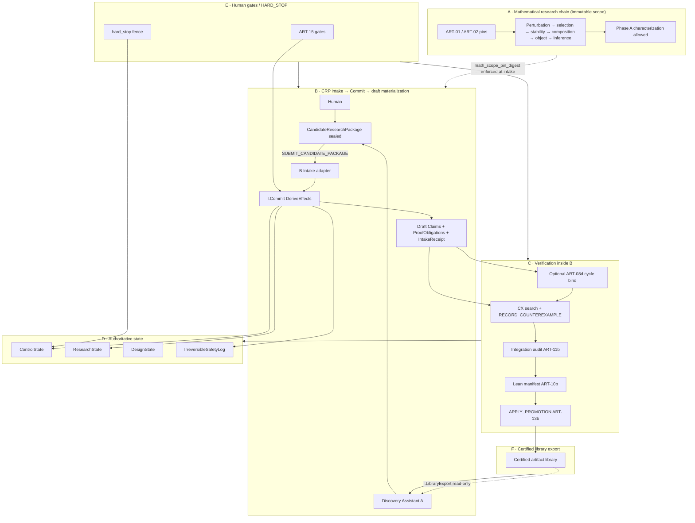
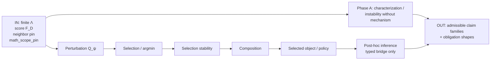
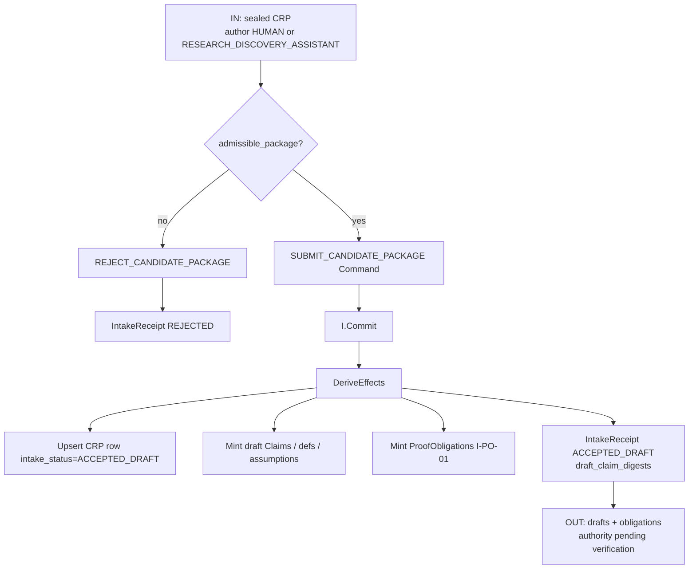
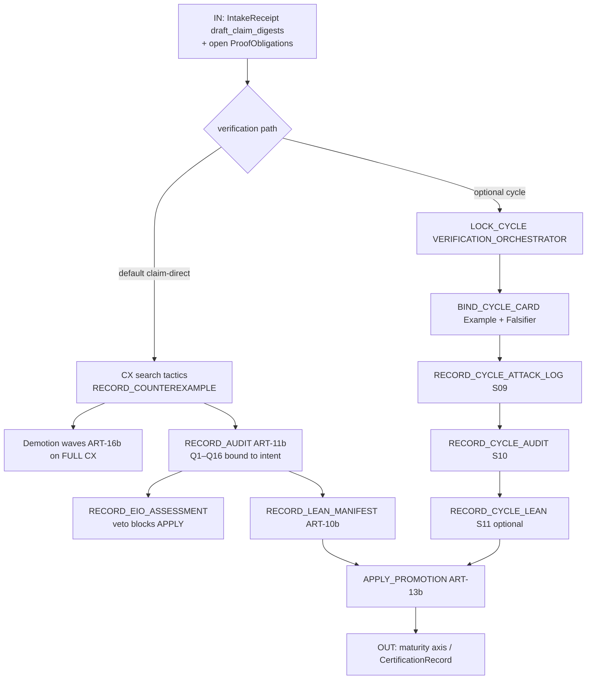
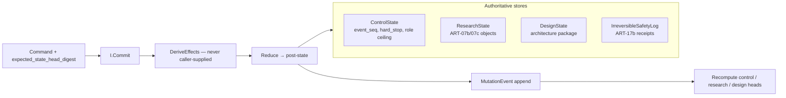
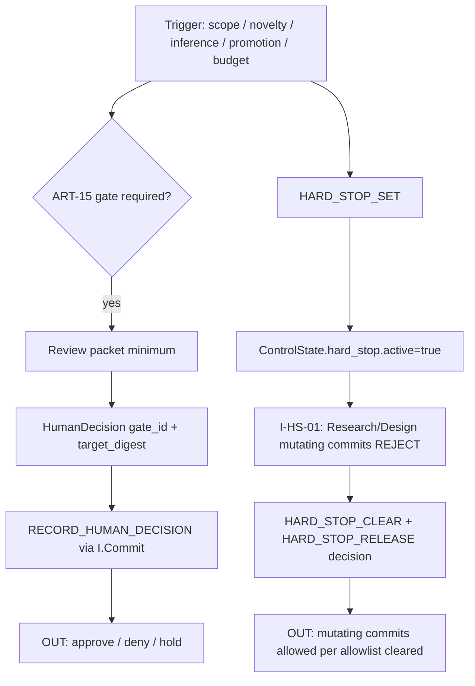

# System B — Verification Architecture Information Flow

**Purpose:** Explain how information moves through **System B (Verification Architecture)** under the dual-system split — not how to implement it.  
**Package:** `ARCH-0.3-REPAIR` · **NON-RELEASE** · **DUAL.2**  
**Normative status:** Narrative companion · aligns with ART-CRP, ART-06b, ART-08d, ART-01V  
**Status note:** `IMPLEMENTATION_BLOCK` ACTIVE · `DESIGN_FINAL` revoked · `ARCHITECTURE_BLUEPRINT_READY = no` · not a build blueprint.

> **DUAL.2 truth:** Primary mathematical flow is **Human|System A → sealed `CandidateResearchPackage` → `SUBMIT_CANDIDATE_PACKAGE` → `I.Commit` → verify/promote**. Discovery engines **never** write `ResearchState`. Intake receipts are **drafts** until Commit `DeriveEffects` succeed.  
> **INCOMPATIBILITY WARNING:** Legacy single-package “design loop drives research cycle” narrative is **obsolete**. Object identity = ART-07b; cert/bridge typing = ART-07c; **mutation = ART-06b `I.Commit` only**. `ResearchState.hard_stop`, caller `*_ok`, and `I.ProposeWrite` are **non-authoritative**.

**Related guides:** [System A flow](../architecture-discovery/ARCHITECTURE_INFORMATION_FLOW.md) · [A↔B bridge](../architecture-visual/DISCOVERY_VERIFIER_INFORMATION_FLOW.md) · canvas `verifier-information-flow.canvas.tsx`

---

## 0. How to read this document

1. **Big picture** — one flowchart of the B-centric system (sections labeled **A–F**).  
2. **Each section** — its own flowchart plus **IN / OUT / WHO / STORE**.  
3. Arrows mean *information or control*, not code calls.  
4. **System A** appears only as a CRP author and read-only library consumer — see [`architecture-discovery/`](../architecture-discovery/) for discovery-cycle detail.

| Symbol | Meaning |
|--------|---------|
| **IN** | What must exist before this section runs |
| **OUT** | What this section produces |
| **WHO** | Role that may act or veto (writes only via B Commit unless noted) |
| **STORE** | Which authoritative store receives durable results |

---

## 1. Big picture — labeled sections (System B)



**Section map**

| ID | Name | One-line job |
|----|------|----------------|
| **A** | Math chain | Immutable Area-1 problem; constrains admissible CRP payloads |
| **B** | CRP intake | Sole external math intake; mint drafts via Commit — **not** live truth |
| **C** | Verification cycle | Attack, audit, Lean, promotion/demotion **inside B only** |
| **D** | Authoritative state | Four stores; **`I.Commit` sole mutator** |
| **E** | Human control | Gates, `HARD_STOP` fence, release decisions |
| **F** | Library export | Certified digests exported read-only to A and humans |

**Forbidden flows (dual-system cut)**

| Flow | Status |
|------|--------|
| A → `APPLY_PROMOTION` / `RECORD_COUNTEREXAMPLE` / ResearchState upsert | **Forbidden** |
| A → `LOCK_CYCLE` on B | **Forbidden** (`VERIFICATION_ORCHESTRATOR` only) |
| B → frontier score / “pick next conjecture” / mechanism invention | **Forbidden** |
| Caller `*_ok` booleans in Commit payload | **Forbidden** (ART-06b §6) |
| Treating CRP payload as authoritative before Commit accept | **Forbidden** (I-CRP-04) |

---

## 2. Section A — Mathematical research chain (immutable scope)

The verification architecture exists to certify claims along this chain. It is **not** a generic discovery engine.



| | |
|--|--|
| **IN** | ART-01 charter pins; ART-02 definition pins (`DEF.neighbor`, `DEF.candidates`, `DEF.score`, …); `math_scope_pin_digest` on every CRP |
| **OUT** | Typed claim families (stability / utility / inference / characterization); profile rules for Phase A vs Phase B CRPs |
| **WHO** | Humans gate scope changes (`SCOPE_CHANGE`, `NEIGHBOR_CHANGE`, …); B **enforces** pins at intake — does not invent scope |
| **STORE** | Pins live in `ResearchState` (ART-07b objects); scope enforcement reads pins — **A does not mutate them** |
| **Must not** | Swap certificate kinds without ART-07c bridge; Phase B stabilization without mechanism when profile requires it; continuous Λ or data-dependent ψ without gates |

**Phase A (DUAL.2):** `profile=PHASE_A_CHARACTERIZATION` CRPs may omit `MechanismInstance`; characterization / instability claims are first-class (ART-CRP I-CRP-02).

---

## 3. Section B — CRP intake → Commit → materialize drafts

**Sole external mathematical intake** into System B. Intake ≠ truth.



| | |
|--|--|
| **IN** | Sealed `CandidateResearchPackage` (`crp_digest`, `profile`, `payload`, `math_scope_pin_digest`, author binding if ASSISTANT) |
| **OUT** | `IntakeReceipt` (`ACCEPTED_DRAFT` or `REJECTED`); draft Claim digests; `ProofObligation` digests; **no** maturity raise |
| **WHO** | `VERIFICATION_ORCHESTRATOR` or `HUMAN_GATE_OPERATOR` issues Commit; A uses `I.DiscoverySubmit` alias that **only** builds the same Command — not a second mutator |
| **STORE** | `ResearchState` (CRP + draft objects + receipt); `EventLog` via Commit |
| **Rule** | I-CRP-01: sole external math intake. I-CRP-04: payload fields are drafts until DeriveEffects. I-CRP-10: after accept, **B commands only** — A does not APPLY |

**Intake path (A-side, non-authoritative until B Commit):**

```text
Discovery Orchestrator / Human → assemble CRP (may speculate)
  → I.DiscoverySubmit (alias) → SUBMIT_CANDIDATE_PACKAGE → I.Commit
```

---

## 4. Section C — Verification / attack / audit / Lean cycle (inside B)

Default post-intake path is **claim-direct** (ART-CRP I-CRP-30). Optional ART-08d cycle binding (I-CRP-31) for card/hop/attack-log discipline.



### 4.1 Claim-direct path (default)

| | |
|--|--|
| **IN** | `draft_claim_digests[]` from IntakeReceipt; CRP `profile` routes audit/CX (ART-11b §0, ART-12-CHAR for characterization) |
| **OUT** | Counterexamples, audit records, Lean manifests, promotion/demotion effects |
| **WHO** | `VERIFICATION_ORCHESTRATOR` commits; Integration Auditor verdict via `RECORD_AUDIT`; EIO assessment; Lean Verifier supplies manifests (read-only) |
| **STORE** | `ResearchState` object tables + side tables; demotion waves before restore/S14 |

### 4.2 Optional cycle-bound path (ART-08d)

| | |
|--|--|
| **IN** | Accepted CRP; `target_claim_digest ∈ draft_claim_digests`; quarantine lock |
| **OUT** | `CycleRecord` phases S02→…→S16; `DerivedS09Ok` / `DerivedMathStable` predicates |
| **WHO** | **`VERIFICATION_ORCHESTRATOR` only** — `FRONTIER_SCHEDULER` (A) never authorizes `LOCK_CYCLE` |
| **STORE** | `CycleRecord`, `QuarantineLock`, `ExampleCard`, `FalsifierCard`, `AttackLog` in ResearchState |
| **Rule** | `LOCK_CYCLE` **optional**; required only for cycle commands (`BIND_CYCLE_CARD`, `RECORD_CYCLE_*`, `ADVANCE_CYCLE`) |

### 4.3 Verification IO summary

| Stage | IN | OUT | WHO | STORE |
|-------|-----|-----|-----|-------|
| Attack | Live draft/target claim digest | CX objects; FULL CX → demotion wave | CX services propose; B `RECORD_COUNTEREXAMPLE` | `ResearchState` CX + waves |
| Audit | Claim + mechanism + cert context | `AuditRecord` PASS/FAIL/IRRELEVANT | Integration Auditor; `hop_chain_ok` derived | `ResearchState` audits |
| Lean | Pinned modules | `LeanManifest`; `DerivedLeanStatus` | Lean Verifier (manifest only) | `ResearchState` lean tables |
| Promote | `PromotionIntent` + gates + EIO ALLOW | Axis write or `AXIS_WRITE_FORBIDDEN` | B `APPLY_PROMOTION`; human gates per ART-15 | `ResearchState` maturity + certs |

---

## 5. Section D — Authoritative state

All durable B authority flows through **`I.Commit`** (ART-06b). Four stores; heads are **derived only**.



| Store | Contents | Mutated only via |
|-------|----------|------------------|
| **ControlState** | `event_seq`, `HardStopRecord`, `role_ceiling_profile_digest` | `I.Commit` |
| **ResearchState** | Claims, CX, audits, Lean, cycles, CRP rows, certs, bridges, … | `I.Commit` |
| **DesignState** | Architecture artifacts, critique ledger | `I.Commit` (`store_targets` includes DESIGN) |
| **IrreversibleSafetyLog** | Checkpoint / safety receipts (not restorable from Research snapshot alone) | `I.Commit` (atomic with event) |

| | |
|--|--|
| **IN** | `Command` with stale-write guard (`expected_state_head_digest`); authenticated principal (ART-04c) |
| **OUT** | `ACCEPTED{event_seq, event_digest, new_state_head_digest}` or `REJECTED{reason_codes[]}` |
| **WHO** | Committer process; proposers supply Command only; **A never calls Commit on ResearchState** |
| **STORE** | All four stores above + append-only `EventLog` |
| **Invariants** | I-MUT-01: no normative write outside Commit. I-HS-01: hard-stop allowlist. I-BOOL-01: no caller `*_ok`. |

**Separation:** I-STATE-SEP-01 — research object authority lives only in `ResearchState`. `ControlState` never holds Claims/certs as research authority.

---

## 6. Section E — Human gates / HARD_STOP

Humans and budget/system signals fence B execution. Gate satisfaction requires ART-04c-valid `HumanDecision` committed via `I.Commit`.



| | |
|--|--|
| **IN** | Escalation packets; audit `ESCALATE_HUMAN` (verdict only — **not** gate satisfaction); budget breach; human interrupt |
| **OUT** | Typed `HumanDecision` digests; freeze/release of mutating commits |
| **WHO** | `HUMAN_GATE_OPERATOR` sets decisions; `HARD_STOP_SET` may be HUMAN/BUDGET/SYSTEM; agents **request** only |
| **STORE** | `ControlState.hard_stop` (authoritative); decisions recorded in Commit log / Research side tables per ART-04c |
| **Not a gate** | Audit verdict `ESCALATE_HUMAN` alone; legacy `ResearchState.hard_stop` / `I.HardStop` direct mutator |

**Package posture (today):**

```text
DESIGN_FINAL = pending_human_approval (revoked)
IMPLEMENTATION_START = blocked
RESEARCH_EXECUTION_START = blocked
IMPLEMENTATION_BLOCK = ACTIVE
```

---

## 7. Section F — Certified library export (read-only to A)

Promotion via ART-13b is the only path into the durable certified library. A consumes exports for retrieval — never for authority.


| | |
|--|--|
| **IN** | Live certified object digests; filter criteria (claim kind, maturity, chain segment, …) |
| **OUT** | Read-only digest list + metadata snapshot; **no** ResearchState mutation |
| **WHO** | B serves export; A `declared_reads[]` in CRP cite prior certs; B re-validates at APPLY |
| **STORE** | Source of truth remains `ResearchState`; library is a **view** over promoted objects |
| **Rule** | I-CRP-10 + dual plan §3: Lib → A is read-only retrieval; resubmission as new CRP if A wants B to re-verify |

---

## 8. Authority lattice (conflict resolution inside B)

When authorities disagree during verification, resolution order (highest first) — ART-05:

1. Human Decision (scoped, ART-04c)  
2. Immutable Charter (ART-01)  
3. Pinned definition (ART-02)  
4. Lean manifest at pin (ART-10b)  
5. Counterexample at pin (ART-12)  
6. Integration Audit PASS (ART-11b)  
7. Literature with primary source  
8. Mechanism sketch / heuristic  
9. Frontier priority (A-local — **not** B write authority)

**OUT:** `resolution_record{winner, loser_ids[], rule, actor_principal_digest, event_seq}`

---

## 9. End-to-end happy path (B-centric narrative)

1. **Scope:** Area-1 pins constrain admissible mathematics (Section A).  
2. **Package:** Human or Discovery Assistant seals a CRP (may speculate).  
3. **Intake:** `SUBMIT_CANDIDATE_PACKAGE` → Commit mints **drafts** + `IntakeReceipt` (Section B).  
4. **Verify:** B runs CX → audit → optional Lean → `APPLY_PROMOTION` on draft claims (Section C, claim-direct default).  
5. **Persist:** All effects via `I.Commit` into four stores (Section D).  
6. **Export:** Certified digests available read-only to A via `I.LibraryExport` (Section F).  
7. **Anytime:** `HARD_STOP` freezes mutating commits until `HARD_STOP_RELEASE` (Section E).

**Blocked today:** No software implementation or live research execution until human lifts `IMPLEMENTATION_BLOCK` and relevant ART-15 gates.

---

## 10. Where to go next

| Topic | Artifact |
|-------|----------|
| Dual-system plan | [00-repair/DUAL_SYSTEM_SEPARATION_PLAN.md](00-repair/DUAL_SYSTEM_SEPARATION_PLAN.md) |
| B charter | [01-charter/CHARTER_VERIFICATION.md](01-charter/CHARTER_VERIFICATION.md) |
| CRP intake | [24-interfaces/CANDIDATE_RESEARCH_PACKAGE.md](24-interfaces/CANDIDATE_RESEARCH_PACKAGE.md) |
| Commit / stores | [06-state/MUTATION_AND_AUTHORITATIVE_STATE.md](06-state/MUTATION_AND_AUTHORITATIVE_STATE.md) |
| Cycle binding | [08-research-cycle/CYCLE_BINDING.md](08-research-cycle/CYCLE_BINDING.md) |
| Interfaces | [24-interfaces/INTERFACE_CONTRACTS.md](24-interfaces/INTERFACE_CONTRACTS.md) |
| Authority | [05-authority/AUTHORITY_MATRIX.md](05-authority/AUTHORITY_MATRIX.md) |
| Gates | [15-human-gates/HUMAN_GATES.md](15-human-gates/HUMAN_GATES.md) |
| Discovery home | [`../architecture-discovery/`](../architecture-discovery/) |
| Package map | [00-README.md](00-README.md) |
